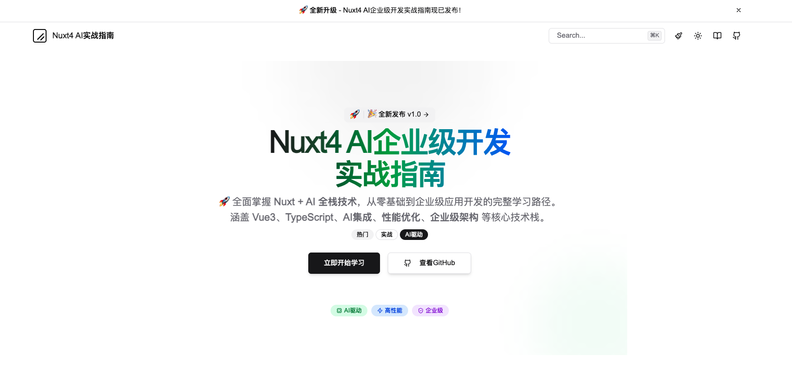

<h1 align="center">《Nuxt4 Alpha AI 企业级技术栈实战指南》文档</h1>

<p align="center">
  <strong>🚀 下一代全栈框架 | 🤖 AI原生 | 🏢 企业级架构 | 📚 前沿技术探索</strong>
</p>

<p align="center">
  <a href="https://nuxt.com" target="_blank">
    
  </a>
  <a href="https://vuejs.org" target="_blank">
    
  </a>
  <a href="https://www.typescriptlang.org" target="_blank">
    
  </a>
  <a href="https://vitejs.dev" target="_blank">
    
  </a>
  <a href="https://tailwindcss.com" target="_blank">
    
  </a>
  <a href="https://openai.com" target="_blank">
    
  </a>
</p>

<p align="center">
  <a href="#📖 项目简介">📖 项目简介</a> •
  <a href="#✨ 核心特性">✨ 核心特性</a> •
  <a href="#🛠️ 前沿技术栈">🛠️ 前沿技术栈</a> •
  <a href="#🤝 贡献指南">🤝 贡献指南</a> •
  <a href="#🏆 项目亮点">🏆 项目亮点</a>
</p>

---

## 📖 项目简介

**Nuxt4 Alpha 企业级技术栈实战指南** 是一个前沿的开源学习文档，专为探索下一代全栈开发技术的开发者学习而设计。基于 Nuxt4 Alpha 版本，展示最新的框架特性、架构设计和 AI 原生集成方案，帮助开发者提前掌握未来的 Web 开发技术。

### 🎯 项目愿景

- **🔮 技术前瞻**：探索下一代 Web 开发技术
- **🤖 AI 原生**：深度学习 AI 功能，构建智能化应用
- **🏢 企业开箱即用**：学习生产级的架构设计和最佳实践
- **🔄 持续演进**：跟随 Nuxt4 发展，及时了解最新特性

## ✨ 核心特性


## 🛠️ 前沿技术栈

<table>
  <tr>
    <td align="center"><strong>核心框架</strong></td>
    <td align="center"><strong>开发语言</strong></td>
    <td align="center"><strong>构建工具</strong></td>
    <td align="center"><strong>AI 服务</strong></td>
  </tr>
  <tr>
    <td align="center">
      <br>
      Nuxt4 Alpha
    </td>
    <td align="center">
      <br>
      TypeScript 5.4
    </td>
    <td align="center">
      <br>
      Vite 5
    </td>
    <td align="center">
      <br>
      OpenAI
    </td>
  </tr>
</table>

<table>
  <tr>
    <td align="center"><strong>UI 框架</strong></td>
    <td align="center"><strong>服务器引擎</strong></td>
    <td align="center"><strong>部署平台</strong></td>
    <td align="center"><strong>开发工具</strong></td>
  </tr>
  <tr>
    <td align="center">
      <br>
      shadcn-vue
    </td>
    <td align="center">
      <br>
      Nitro 2.8+
    </td>
    <td align="center">
      <br>
      Vercel/Netlify
    </td>
    <td align="center">
      <br>
      Vitest
    </td>
  </tr>
</table>


## 🚀 快速开始

### 前置要求

- **Node.js** >= 20.0.0
- **pnpm** >= 8.0.0 (推荐)
- **Git** 版本控制

### 安装步骤

1. **克隆项目**
   ```bash
   git clone https://github.com/WebJeffery/ai-nuxt-docs.git
   cd ai-nuxt-docs
   ```

2. **安装依赖**
   ```bash
   pnpm install
   ```

3. **环境配置**
   ```bash
   cp .env.example .env
   # 编辑 .env 文件，配置必要的环境变量
   ```

4. **启动开发服务器**
   ```bash
   pnpm dev
   ```

5. **访问应用**

   打开浏览器访问 [http://localhost:3000](http://localhost:3000)


## 🤝 贡献指南

我们欢迎所有形式的贡献！无论你是：

### 💡 内容贡献者
- **📝 文档编写** - 改进现有文档或添加新内容
- **🎯 案例开发** - 提供实战项目案例
- **🔧 最佳实践** - 分享开发经验和技巧

### 🛠️ 技术贡献者
- **🐛 Bug修复** - 发现并修复问题
- **✨ 功能开发** - 添加新功能特性
- **⚡ 性能优化** - 提升应用性能

### 🎨 设计贡献者
- **🎭 UI设计** - 改进用户界面
- **📱 交互优化** - 提升用户体验
- **🎬 动效设计** - 增强视觉效果

### 📋 如何开始贡献

1. **🍴 Fork 项目** 到你的 GitHub
2. **🌿 创建特性分支** `git checkout -b feature/amazing-feature`
3. **💾 提交更改** `git commit -m 'Add some amazing feature'`
4. **📤 推送分支** `git push origin feature/amazing-feature`
5. **🔄 提交 Pull Request**

### 📜 贡献准则

- 遵循 [代码规范](./docs/CONTRIBUTING.md#代码规范)
- 添加相应的测试用例
- 更新相关文档
- 保持 commit 信息清晰

## 🌟 贡献者

感谢所有为项目做出贡献的开发者！

<a href="https://github.com/WebJeffery/ai-nuxt-docs/graphs/contributors">
  
</a>

## 🌟 社区与支持

### 💬 交流渠道
- **🐛 Issues**: [GitHub Issues](https://github.com/WebJeffery/ai-nuxt-docs/issues) - 问题反馈
- **💡 Discussions**: [GitHub Discussions](https://github.com/WebJeffery/ai-nuxt-docs/discussions) - 技术讨论
- **📺 B站**: 视频教程和技术分享
- **📧 邮件**: contact@nuxt4.dev


## 📄 许可证

本项目基于 [MIT License](./LICENSE) 开源许可证。

你可以自由地：
- ✅ 商业使用
- ✅ 修改代码
- ✅ 分发项目
- ✅ 私人使用

只需保留原作者版权信息。

## 🙏 致谢

特别感谢以下技术和社区：

- [Nuxt.js 团队](https://nuxt.com/team) - 创造了优秀的全栈框架
- [Vue.js 团队](https://vuejs.org/about/team.html) - 提供了强大的前端基础
- [UnJS 社区](https://unjs.io/) - 构建了现代化的工具生态
- [Vite 团队](https://vitejs.dev/team.html) - 带来了极速的开发体验
- [TypeScript 团队](https://www.typescriptlang.org/) - 提供了强大的类型系统

## 🎉 Star History

[](https://star-history.com/#WebJeffery/ai-nuxt-docs&Date)

---

<p align="center">
  <strong>🌟 探索 Nuxt4 的未来，从现在开始！</strong>
</p>

<p align="center">
  <a href="https://github.com/WebJeffery/ai-nuxt-docs/stargazers">
    
  </a>
  <a href="https://github.com/WebJeffery/ai-nuxt-docs/network/members">
    
  </a>
  <a href="https://twitter.com/intent/tweet?text=Exploring%20the%20future%20of%20web%20development%20with%20Nuxt4%20Alpha!&url=https://github.com/WebJeffery/ai-nuxt-docs">
    
  </a>
</p>
