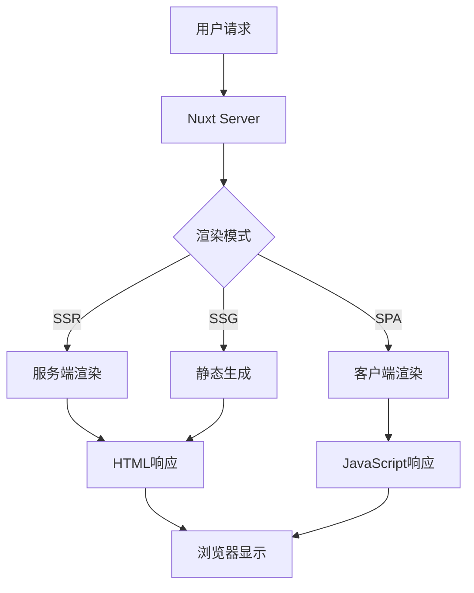

## 🎯 Nuxt4 概览

**Nuxt4** 是一个基于Vue.js的全栈框架，专为现代化Web应用而设计。它提供了开箱即用的SSR、SSG、CSR等多种渲染模式，同时内置了路由、状态管理、SEO优化等企业级功能。

::alert{icon="lucide:info" color="blue"}
**为什么选择Nuxt3？**
- 🚀 **开箱即用**: 无需复杂配置即可开始开发
- 🎨 **灵活渲染**: 支持SSR、SSG、CSR等多种渲染模式
- 📱 **响应式开发**: 基于Vue3的现代化组件开发
- 🔧 **企业级**: 内置TypeScript、自动导入、模块化等特性
::

## 🏗️ Nuxt4 核心架构

### 应用架构概览



### 渲染概念解析

Nuxt3提供了三种主要的渲染模式,了解它们的差异和应用场景:

:::card-group{cols=3}
  ::::card{icon="lucide:server"}
  #title
  **服务端渲染 (SSR)**
  #description
  在服务器端完成页面渲染,返回完整HTML给浏览器

  **优势:**
  - 更好的SEO表现
  - 更快的首屏加载
  - 适合动态内容

  **适用场景:**
  - 内容频繁更新
  - 需要SEO的页面
  - 个性化内容展示

  ```typescript
  // nuxt.config.ts
  export default defineNuxtConfig({
    ssr: true, // 默认开启
    routeRules: {
      '/dashboard': { ssr: true }
    }
  });
  ```
  ::::

  ::::card{icon="lucide:zap"}
  #title
  **静态生成 (SSG)**
  #description
  构建时预渲染页面,生成静态HTML文件

  **优势:**
  - 极致的加载性能
  - 低服务器压力
  - 可部署到CDN

  **适用场景:**
  - 营销页面
  - 文档站点
  - 内容变化不频繁

  ```typescript
  // nuxt.config.ts
  export default defineNuxtConfig({
    nitro: {
      prerender: {
        routes: ['/about', '/posts/*'],
        crawlLinks: true,
        ignore: ['/admin']
      }
    }
  });
  ```
  ::::

  ::::card{icon="lucide:monitor"}
  #title
  **客户端渲染 (CSR)**
  #description
  在浏览器端完成页面渲染,服务端只返回基础HTML

  **优势:**
  - 更好的交互体验
  - 减轻服务器负担
  - 适合SPA应用

  **适用场景:**
  - 后台管理系统
  - 数据可视化
  - 重交互应用

  ```typescript
  // nuxt.config.ts
  export default defineNuxtConfig({
    routeRules: {
      '/admin/**': { ssr: false }
    }
  });
  ```
  ::::
:::

## 📁 项目结构详解

Nuxt3遵循约定优于配置的原则，提供了清晰的目录结构：

```
nuxt-app/
├── 📁 .nuxt/              # 自动生成的构建文件
├── 📁 .output/            # 生产构建输出
├── 📁 assets/             # 需要处理的资源文件
│   ├── css/              # 样式文件
│   ├── images/           # 图片资源
│   └── fonts/            # 字体文件
├── 📁 components/         # Vue组件
│   ├── global/           # 全局组件 (自动导入)
│   └── ui/               # UI组件
├── 📁 composables/        # 组合式函数
│   ├── useAuth.ts        # 认证逻辑
│   ├── useApi.ts         # API请求
│   └── useState.ts       # 状态管理
├── 📁 content/            # Nuxt Content文件
├── 📁 layouts/            # 布局组件
│   ├── default.vue       # 默认布局
│   └── admin.vue         # 管理后台布局
├── 📁 middleware/         # 路由中间件
│   ├── auth.ts           # 认证中间件
│   └── redirect.ts       # 重定向逻辑
├── 📁 pages/              # 页面文件 (文件系统路由)
│   ├── index.vue         # 首页 (/)
│   ├── about.vue         # 关于页面 (/about)
│   └── admin/
│       └── index.vue     # 管理首页 (/admin)
├── 📁 plugins/            # 插件文件
│   ├── api.client.ts     # 客户端API插件
│   └── auth.server.ts    # 服务端认证插件
├── 📁 public/             # 静态文件 (直接访问)
├── 📁 server/             # 服务器端代码
│   ├── api/              # API路由
│   │   ├── auth/         # 认证API
│   │   └── users.get.ts  # 用户API
│   ├── middleware/       # 服务器中间件
│   └── utils/            # 服务器工具
├── 📁 stores/             # Pinia状态管理
├── 📁 utils/              # 工具函数 (自动导入)
├── 📄 app.vue             # 根组件
├── 📄 nuxt.config.ts      # Nuxt配置文件
└── 📄 package.json        # 项目依赖
```

### 🔄 自动导入机制

Nuxt3提供了强大的自动导入功能，让开发更加简洁：

::code-group
```vue [pages/index.vue]
<template>
  <div>
    <!-- 组件自动导入 -->
    <UiButton @click="handleClick">
      点击我
    </UiButton>

    <!-- 布局自动应用 -->
    <UserProfile :user="user" />
  </div>
</template>

<script setup>
// 组合式函数自动导入
const { user } = useAuth();
const { $api } = useNuxtApp();

// 工具函数自动导入
function handleClick() {
  navigateTo('/dashboard');
}

// 响应式数据自动导入
const count = ref(0);
const doubled = computed(() => count.value * 2);
</script>
```

```typescript [composables/useAuth.ts]
// 自动导入的组合式函数
export function useAuth() {
  const user = useState('auth.user', () => null);

  const login = async (credentials) => {
    // 登录逻辑
    const response = await $fetch('/api/auth/login', {
      method: 'POST',
      body: credentials
    });
    user.value = response.user;
  };

  const logout = () => {
    user.value = null;
    navigateTo('/login');
  };

  return {
    user: readonly(user),
    login,
    logout
  };
}
```
::

## 🎨 页面和路由系统

### 文件系统路由

Nuxt3使用文件系统自动生成路由，无需手动配置：

```
pages/
├── index.vue           # / (根路由)
├── about.vue           # /about
├── contact.vue         # /contact
├── blog/
│   ├── index.vue       # /blog
│   ├── [slug].vue      # /blog/:slug (动态路由)
│   └── [...tags].vue   # /blog/* (通配符路由)
├── user/
│   ├── [id].vue        # /user/:id
│   └── settings/
│       ├── index.vue   # /user/settings
│       └── profile.vue # /user/settings/profile
└── admin/
    ├── index.vue       # /admin
    └── [[...slug]].vue # /admin/** (可选动态路由)
```

### 动态路由实例

::code-group
```vue [pages/blog/[slug].vue]
<template>
  <div>
    <h1>{{ post.title }}</h1>
    <p>{{ post.content }}</p>
  </div>
</template>

<script setup>
// 获取路由参数
const route = useRoute();
const slug = route.params.slug;

// 服务端数据获取
const { data: post } = await useFetch(`/api/posts/${slug}`);

// SEO优化
useSeoMeta({
  title: post.value.title,
  description: post.value.excerpt
});
</script>
```

```vue [pages/user/[id]/settings.vue]
<template>
  <div>
    <h2>用户设置</h2>
    <UserForm :user="user" @save="updateUser" />
  </div>
</template>

<script setup>
const route = useRoute();
const userId = route.params.id;

// 中间件保护
definePageMeta({
  middleware: 'auth'
});

// 数据获取
const { data: user } = await useFetch(`/api/users/${userId}`);

async function updateUser(userData) {
  await $fetch(`/api/users/${userId}`, {
    method: 'PUT',
    body: userData
  });

  // 刷新数据
  await refreshCookie('user');
}
</script>
```
::

## 🔌 服务器端API

Nuxt3提供了内置的服务器端API功能，可以创建全栈应用：

### API路由结构

```
server/
├── api/
│   ├── auth/
│   │   ├── login.post.ts    # POST /api/auth/login
│   │   └── logout.delete.ts # DELETE /api/auth/logout
│   ├── users/
│   │   ├── index.get.ts     # GET /api/users
│   │   ├── index.post.ts    # POST /api/users
│   │   └── [id].get.ts      # GET /api/users/:id
│   └── ai/
│       ├── chat.post.ts     # POST /api/ai/chat
│       └── generate.post.ts # POST /api/ai/generate
├── middleware/
│   └── auth.ts              # 服务器中间件
└── utils/
    ├── db.ts                # 数据库工具
    └── jwt.ts               # JWT工具
```

### API实现示例

::code-group
```typescript [server/api/ai/chat.post.ts]
import { OpenAI } from 'openai';

const openai = new OpenAI({
  apiKey: useRuntimeConfig().openaiApiKey
});

export default defineEventHandler(async (event) => {
  // 请求体验证
  const body = await readBody(event);
  const { message, conversation } = body;

  if (!message) {
    throw createError({
      statusCode: 400,
      statusMessage: 'Message is required'
    });
  }

  try {
    // AI服务调用
    const completion = await openai.chat.completions.create({
      model: 'gpt-4-turbo-preview',
      messages: [
        ...conversation,
        { role: 'user', content: message }
      ],
      temperature: 0.7,
      max_tokens: 1000
    });

    return {
      success: true,
      response: completion.choices[0].message.content
    };
  } catch (error) {
    throw createError({
      statusCode: 500,
      statusMessage: 'AI service error'
    });
  }
});
```

```typescript [server/api/users/[id].get.ts]
import jwt from 'jsonwebtoken';
import { getUserById } from '~/server/utils/db';

export default defineEventHandler(async (event) => {
  // 认证检查
  const token = getCookie(event, 'auth-token') || getHeader(event, 'authorization');

  if (!token) {
    throw createError({
      statusCode: 401,
      statusMessage: 'Unauthorized'
    });
  }

  try {
    // 验证JWT
    const { userId } = jwt.verify(token, useRuntimeConfig().jwtSecret);
    const requestedId = getRouterParam(event, 'id');

    // 权限检查
    if (userId !== requestedId) {
      throw createError({
        statusCode: 403,
        statusMessage: 'Forbidden'
      });
    }

    // 获取用户数据
    const user = await getUserById(requestedId);

    if (!user) {
      throw createError({
        statusCode: 404,
        statusMessage: 'User not found'
      });
    }

    // 返回安全的用户数据
    const { password, ...safeUser } = user;
    return safeUser;
  } catch (error) {
    throw createError({
      statusCode: 401,
      statusMessage: 'Invalid token'
    });
  }
});
```
::

## 🎭 布局系统

### 布局组件

布局组件定义了页面的通用结构：

::code-group
```vue [layouts/default.vue]
<template>
  <div class="min-h-screen bg-background">
    <!-- 顶部导航 -->
    <header class="border-b bg-background/95 backdrop-blur">
      <div class="container flex h-16 items-center space-x-4">
        <Logo />
        <MainNav />
        <div class="ml-auto flex items-center space-x-4">
          <UserMenu />
          <ThemeToggle />
        </div>
      </div>
    </header>

    <!-- 主要内容区域 -->
    <main class="flex-1">
      <slot />
    </main>

    <!-- 页脚 -->
    <footer class="border-t">
      <div class="container py-8">
        <FooterContent />
      </div>
    </footer>
  </div>
</template>

<script setup>
// 全局状态
const { user } = useAuth();

// SEO设置
useHead({
  titleTemplate: '%s - Nuxt4 AI企业级应用',
  meta: [
    { name: 'viewport', content: 'width=device-width, initial-scale=1' }
  ]
});
</script>
```

```vue [layouts/admin.vue]
<template>
  <div class="min-h-screen bg-gray-50">
    <!-- 侧边栏 -->
    <aside class="fixed inset-y-0 left-0 w-64 bg-white shadow-lg">
      <AdminSidebar />
    </aside>

    <!-- 主内容区 -->
    <div class="ml-64">
      <!-- 顶部栏 -->
      <header class="bg-white shadow-sm border-b">
        <AdminHeader />
      </header>

      <!-- 页面内容 -->
      <main class="p-6">
        <slot />
      </main>
    </div>
  </div>
</template>

<script setup>
// 管理员权限检查
definePageMeta({
  middleware: 'admin'
});

// 管理后台特定的设置
useHead({
  titleTemplate: '%s - 管理后台'
});
</script>
```
::

### 页面中使用布局

```vue [pages/admin/dashboard.vue]
<template>
  <div>
    <h1>仪表板</h1>
    <DashboardStats />
    <RecentActivity />
  </div>
</template>

<script setup>
// 指定使用admin布局
definePageMeta({
  layout: 'admin'
});
</script>
```

## 🔄 中间件系统

中间件允许你在页面渲染前执行代码：

::code-group
```typescript [middleware/auth.ts]
// 认证中间件
export default defineNuxtRouteMiddleware((to, from) => {
  const { user } = useAuth();

  // 检查用户是否已登录
  if (!user.value) {
    return navigateTo('/login');
  }
});
```

```typescript [middleware/admin.ts]
// 管理员权限中间件
export default defineNuxtRouteMiddleware((to, from) => {
  const { user } = useAuth();

  // 检查管理员权限
  if (!user.value || user.value.role !== 'admin') {
    throw createError({
      statusCode: 403,
      statusMessage: 'Access Denied'
    });
  }
});
```

```typescript [middleware/redirect.global.ts]
// 全局中间件 (自动应用到所有路由)
export default defineNuxtRouteMiddleware((to, from) => {
  // 记录页面访问
  if (process.client) {
    console.log(`Navigating from ${from.path} to ${to.path}`);
  }

  // 旧路径重定向
  if (to.path === '/old-page') {
    return navigateTo('/new-page', { redirectCode: 301 });
  }
});
```
::

## 💾 状态管理

### useState (内置状态)

```typescript [composables/useAppState.ts]
// 应用级状态管理
export function useAppState() {
  // 全局状态
  const isLoading = useState('app.loading', () => false);
  const notifications = useState('app.notifications', () => []);

  // 方法
  const addNotification = (notification) => {
    notifications.value.push({
      id: Date.now(),
      ...notification
    });
  };

  const removeNotification = (id) => {
    const index = notifications.value.findIndex(n => n.id === id);
    if (index > -1) {
      notifications.value.splice(index, 1);
    }
  };

  return {
    isLoading,
    notifications: readonly(notifications),
    addNotification,
    removeNotification
  };
}
```

### Pinia集成

```typescript [stores/user.ts]
import { defineStore } from 'pinia';

export const useUserStore = defineStore('user', () => {
  // 状态
  const user = ref(null);
  const preferences = ref({
    theme: 'system',
    language: 'zh-CN'
  });

  // 计算属性
  const isLoggedIn = computed(() => !!user.value);
  const displayName = computed(() => {
    return user.value?.name || user.value?.email || 'Guest';
  });

  // 动作
  const setUser = (userData) => {
    user.value = userData;
  };

  const updatePreferences = (newPrefs) => {
    preferences.value = { ...preferences.value, ...newPrefs };
  };

  const logout = () => {
    user.value = null;
    navigateTo('/login');
  };

  return {
    user,
    preferences,
    isLoggedIn,
    displayName,
    setUser,
    updatePreferences,
    logout
  };
});
```

## 🔧 配置和扩展

### Nuxt模块

```typescript [nuxt.config.ts]
export default defineNuxtConfig({
  // 扩展模块
  modules: [
    '@nuxtjs/tailwindcss', // Tailwind CSS
    '@pinia/nuxt', // 状态管理
    '@nuxtjs/color-mode', // 主题切换
    '@vueuse/nuxt', // VueUse工具库
    '@nuxt/content', // 内容管理
    '@nuxt/image', // 图片优化
  ],

  // 模块配置
  colorMode: {
    preference: 'system',
    fallback: 'light',
    hid: 'nuxt-color-mode-script',
    globalName: '__NUXT_COLOR_MODE__',
    componentName: 'ColorScheme',
    classPrefix: '',
    classSuffix: '',
    storageKey: 'nuxt-color-mode'
  },

  // 自动导入配置
  imports: {
    dirs: [
      'composables',
      'utils',
      'stores'
    ]
  }
});
```

## 🎯 最佳实践

::alert{icon="lucide:lightbulb" color="blue"}
### 🌟 Nuxt3开发建议

1. **合理使用SSR/SSG**: 根据页面特性选择渲染模式
2. **充分利用自动导入**: 减少样板代码，提高开发效率
3. **模块化开发**: 使用组合式函数封装业务逻辑
4. **性能优化**: 合理使用`useLazyFetch`和动态导入
5. **SEO友好**: 使用`useSeoMeta`和结构化数据
6. **类型安全**: 充分利用TypeScript类型推导
::

## 🚀 下一步学习

掌握了Nuxt3基础概念后，建议继续学习：

:::card-group{cols=2}
  ::::card{icon="lucide:code"}
  #title
  [Vue3 组合式API](/getting-started/writing/vue3-composition-api)
  #description
  深入学习Vue3的现代化开发模式
  ::::

  ::::card{icon="lucide:type"}
  #title
  [TypeScript 集成](/getting-started/writing/typescript-integration)
  #description
  掌握TypeScript在Nuxt3中的最佳实践
  ::::
:::
