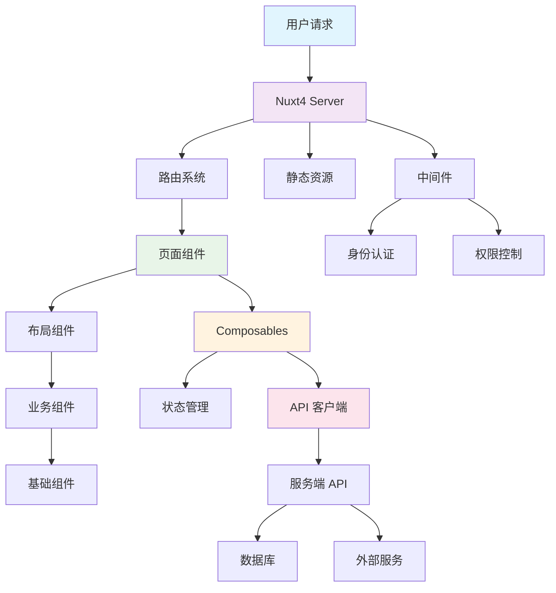

## 1、架构设计概述

### 1.1 什么是系统架构

系统架构是软件系统的基础蓝图，定义了系统的组织结构、组件关系、设计原则和演化指导。在 Nuxt4 企业级项目中，良好的架构设计直接影响：

- **可维护性**: 代码易于理解和修改
- **可扩展性**: 系统能够适应业务增长
- **可测试性**: 便于单元测试和集成测试
- **团队协作**: 多人开发时的代码组织和分工
- **性能优化**: 合理的架构有助于性能提升

### 1.2 Nuxt4 架构设计原则

::card-group{cols=2}
  ::::card{icon="lucide:layers"}
  #title
  **分层架构**
  #description
  - 表现层（UI组件）
  - 业务逻辑层（Composables）
  - 数据访问层（API/Store）
  - 基础设施层（工具/配置）
  ::::

  ::::card{icon="lucide:puzzle"}
  #title
  **模块化设计**
  #description
  - 按功能划分模块
  - 高内聚低耦合
  - 可插拔的组件设计
  - 清晰的依赖关系
  ::::

  ::::card{icon="lucide:shield"}
  #title
  **关注点分离**
  #description
  - UI与业务逻辑分离
  - 数据与展示分离
  - 配置与代码分离
  - 开发与生产分离
  ::::

  ::::card{icon="lucide:workflow"}
  #title
  **约定优于配置**
  #description
  - 标准化的目录结构
  - 统一的命名规范
  - 自动化的路由生成
  - 智能的代码分割
  ::::
::

## 2、Nuxt4 核心架构

### 2.1 整体架构图



### 2.2 核心层次解析

#### 2.2.1 服务端运行时（Nitro）

**核心职责**：
- 处理 HTTP 请求和响应
- 服务端渲染（SSR）
- 静态文件服务
- API 路由处理

**工作原理**：
```typescript
// Nitro 服务器配置
export default defineNuxtConfig({
  nitro: {
    preset: 'node-server',
    experimental: {
      wasm: true
    },
    storage: {
      redis: {
        driver: 'redis',
        // Redis 配置
      }
    },
    routeRules: {
      '/api/**': {
        cors: true,
        headers: { 'cache-control': 's-maxage=60' }
      }
    }
  }
});
```

#### 2.2.2 路由系统

**文件系统路由**：
- 基于文件结构自动生成路由
- 支持动态路由和嵌套路由
- 路由级别的代码分割

**路由结构示例**：
```
pages/
├── index.vue           # /
├── about.vue           # /about
├── users/
│   ├── index.vue       # /users
│   ├── [id].vue        # /users/:id
│   └── profile/
│       └── index.vue   # /users/profile
└── [...slug].vue       # 捕获所有路由
```

#### 2.2.3 组件层次架构

**组件分层设计**：

```typescript
// 组件层次结构
interface ComponentHierarchy {
  // 页面组件 - 最顶层
  pages: {
    responsibility: '页面级组件，对应路由';
    examples: ['pages/index.vue', 'pages/user/profile.vue'];
  };

  // 布局组件 - 页面模板
  layouts: {
    responsibility: '页面布局和共享UI';
    examples: ['layouts/default.vue', 'layouts/admin.vue'];
  };

  // 业务组件 - 功能模块
  components: {
    business: {
      responsibility: '特定业务逻辑组件';
      examples: ['UserProfile', 'ProductList', 'OrderForm'];
    };

    // 通用组件 - 可复用
    common: {
      responsibility: '通用UI组件';
      examples: ['Button', 'Modal', 'Table', 'Form'];
    };

    // 基础组件 - 原子级
    base: {
      responsibility: '最小粒度组件';
      examples: ['Icon', 'Typography', 'Spinner'];
    };
  };
}
```

## 3、模块化架构设计

### 3.1 功能模块划分

#### 3.1.1 按业务域划分

**用户管理模块**：
```
modules/user/
├── components/           # 用户相关组件
│   ├── UserCard.vue
│   ├── UserForm.vue
│   └── UserList.vue
├── composables/         # 用户业务逻辑
│   ├── useUser.ts
│   ├── useUserAuth.ts
│   └── useUserProfile.ts
├── stores/              # 用户状态管理
│   └── userStore.ts
├── types/               # 用户类型定义
│   └── user.types.ts
└── utils/               # 用户工具函数
    └── userHelpers.ts
```

**商品管理模块**：
```
modules/product/
├── components/
│   ├── ProductCard.vue
│   ├── ProductFilter.vue
│   └── ProductDetail.vue
├── composables/
│   ├── useProduct.ts
│   └── useProductSearch.ts
├── stores/
│   └── productStore.ts
└── types/
    └── product.types.ts
```

#### 3.1.2 按技术层次划分

**基础设施层**：
```
infrastructure/
├── api/                 # API 客户端
│   ├── client.ts
│   ├── interceptors.ts
│   └── endpoints.ts
├── config/              # 配置管理
│   ├── env.ts
│   ├── constants.ts
│   └── settings.ts
├── utils/               # 工具函数
│   ├── validation.ts
│   ├── formatting.ts
│   └── helpers.ts
└── services/            # 外部服务
    ├── authService.ts
    ├── storageService.ts
    └── notificationService.ts
```

### 3.2 Composables 设计模式

#### 3.2.1 数据获取 Composables

```typescript
// composables/useApi.ts
export function useApi() {
  const { $fetch } = useNuxtApp();

  const get = async <T>(url: string, options?: FetchOptions): Promise<T> => {
    return await $fetch<T>(url, {
      method: 'GET',
      ...options
    });
  };

  const post = async <T>(url: string, data: any, options?: FetchOptions): Promise<T> => {
    return await $fetch<T>(url, {
      method: 'POST',
      body: data,
      ...options
    });
  };

  return { get, post };
}

// composables/useUser.ts
export function useUser() {
  const { get, post } = useApi();

  const fetchUsers = async (params?: UserQueryParams): Promise<User[]> => {
    return await get<User[]>('/api/users', { params });
  };

  const createUser = async (userData: CreateUserData): Promise<User> => {
    return await post<User>('/api/users', userData);
  };

  return {
    fetchUsers,
    createUser
  };
}
```

#### 3.2.2 状态管理 Composables

```typescript
// composables/useUserState.ts
export function useUserState() {
  const users = ref<User[]>([]);
  const loading = ref(false);
  const error = ref<string | null>(null);

  const { fetchUsers, createUser } = useUser();

  const loadUsers = async (params?: UserQueryParams) => {
    try {
      loading.value = true;
      error.value = null;
      users.value = await fetchUsers(params);
    } catch (err) {
      error.value = err instanceof Error ? err.message : 'Unknown error';
    } finally {
      loading.value = false;
    }
  };

  const addUser = async (userData: CreateUserData) => {
    try {
      const newUser = await createUser(userData);
      users.value.push(newUser);
      return newUser;
    } catch (err) {
      error.value = err instanceof Error ? err.message : 'Failed to create user';
      throw err;
    }
  };

  return {
    users: readonly(users),
    loading: readonly(loading),
    error: readonly(error),
    loadUsers,
    addUser
  };
}
```

## 4、状态管理架构

### 4.1 Pinia 店铺设计

#### 4.1.1 用户状态管理

```typescript
// stores/userStore.ts
export const useUserStore = defineStore('user', () => {
  // 状态
  const users = ref<User[]>([]);
  const currentUser = ref<User | null>(null);
  const loading = ref(false);

  // 计算属性
  const totalUsers = computed(() => users.value.length);
  const activeUsers = computed(() =>
    users.value.filter(user => user.status === 'active')
  );

  // 动作
  const fetchUsers = async () => {
    loading.value = true;
    try {
      const response = await $fetch<User[]>('/api/users');
      users.value = response;
    } catch (error) {
      console.error('Failed to fetch users:', error);
    } finally {
      loading.value = false;
    }
  };

  const setCurrentUser = (user: User) => {
    currentUser.value = user;
  };

  const updateUser = async (id: string, userData: Partial<User>) => {
    try {
      const updatedUser = await $fetch<User>(`/api/users/${id}`, {
        method: 'PUT',
        body: userData
      });

      const index = users.value.findIndex(u => u.id === id);
      if (index !== -1) {
        users.value[index] = updatedUser;
      }

      return updatedUser;
    } catch (error) {
      console.error('Failed to update user:', error);
      throw error;
    }
  };

  return {
    users,
    currentUser,
    loading,
    totalUsers,
    activeUsers,
    fetchUsers,
    setCurrentUser,
    updateUser
  };
});
```

#### 4.1.2 应用状态管理

```typescript
// stores/appStore.ts
export const useAppStore = defineStore('app', () => {
  const theme = ref<'light' | 'dark'>('light');
  const sidebarOpen = ref(false);
  const notifications = ref<Notification[]>([]);

  const toggleTheme = () => {
    theme.value = theme.value === 'light' ? 'dark' : 'light';
  };

  const toggleSidebar = () => {
    sidebarOpen.value = !sidebarOpen.value;
  };

  const addNotification = (notification: Omit<Notification, 'id'>) => {
    const newNotification = {
      ...notification,
      id: Date.now().toString()
    };
    notifications.value.push(newNotification);
  };

  const removeNotification = (id: string) => {
    const index = notifications.value.findIndex(n => n.id === id);
    if (index !== -1) {
      notifications.value.splice(index, 1);
    }
  };

  return {
    theme,
    sidebarOpen,
    notifications,
    toggleTheme,
    toggleSidebar,
    addNotification,
    removeNotification
  };
});
```

## 5、服务端架构

### 5.1 API 路由设计

#### 5.1.1 RESTful API 结构

```typescript
// server/api/users/index.get.ts
export default defineEventHandler(async (event) => {
  try {
    const query = getQuery(event);
    const users = await getUsersFromDatabase(query);

    return {
      success: true,
      data: users,
      meta: {
        total: users.length,
        page: query.page || 1,
        limit: query.limit || 10
      }
    };
  } catch (error) {
    throw createError({
      statusCode: 500,
      statusMessage: 'Failed to fetch users'
    });
  }
});

// server/api/users/[id].get.ts
export default defineEventHandler(async (event) => {
  const id = getRouterParam(event, 'id');

  if (!id) {
    throw createError({
      statusCode: 400,
      statusMessage: 'User ID is required'
    });
  }

  try {
    const user = await getUserById(id);

    if (!user) {
      throw createError({
        statusCode: 404,
        statusMessage: 'User not found'
      });
    }

    return {
      success: true,
      data: user
    };
  } catch (error) {
    throw createError({
      statusCode: 500,
      statusMessage: 'Failed to fetch user'
    });
  }
});
```

#### 5.1.2 中间件设计

```typescript
// server/middleware/auth.ts
export default defineEventHandler(async (event) => {
  // 只对API路由应用认证
  if (!event.node.req.url?.startsWith('/api/')) {
    return;
  }

  const token = getCookie(event, 'auth-token')
    || getHeader(event, 'authorization')?.replace('Bearer ', '');

  if (!token) {
    throw createError({
      statusCode: 401,
      statusMessage: 'Authentication required'
    });
  }

  try {
    const payload = await verifyJWT(token);
    event.context.user = payload;
  } catch (error) {
    throw createError({
      statusCode: 401,
      statusMessage: 'Invalid token'
    });
  }
});

// server/middleware/cors.ts
export default defineEventHandler(async (event) => {
  setHeaders(event, {
    'Access-Control-Allow-Origin': '*',
    'Access-Control-Allow-Methods': 'GET,HEAD,PUT,PATCH,POST,DELETE',
    'Access-Control-Allow-Headers': 'Content-Type, Authorization'
  });

  if (event.node.req.method === 'OPTIONS') {
    event.node.res.statusCode = 204;
    event.node.res.end();
  }
});
```

## 6、组件设计模式

### 6.1 组件组合模式

#### 6.1.1 高阶组件设计

```vue
<!-- components/common/DataTable.vue -->
<template>
  <div class="data-table">
    <div class="table-header">
      <slot name="header" :data="data">
        <h2>{{ title }}</h2>
      </slot>
    </div>

    <div class="table-filters">
      <slot name="filters" :filters="filters" :apply-filters="applyFilters">
        <!-- 默认过滤器 -->
      </slot>
    </div>

    <div class="table-content">
      <table>
        <thead>
          <tr>
            <th v-for="column in columns" :key="column.key">
              {{ column.label }}
            </th>
          </tr>
        </thead>
        <tbody>
          <tr v-for="item in filteredData" :key="item.id">
            <td v-for="column in columns" :key="column.key">
              <slot
                :name="`cell-${column.key}`"
                :item="item"
                :value="item[column.key]"
              >
                {{ item[column.key] }}
              </slot>
            </td>
          </tr>
        </tbody>
      </table>
    </div>

    <div class="table-footer">
      <slot name="footer" :data="filteredData">
        <pagination
          :current-page="currentPage"
          :total-pages="totalPages"
          @page-change="handlePageChange"
        />
      </slot>
    </div>
  </div>
</template>

<script setup lang="ts">
interface Column {
  key: string;
  label: string;
  sortable?: boolean;
}

interface Props {
  data: any[];
  columns: Column[];
  title?: string;
  pageSize?: number;
}

const props = withDefaults(defineProps<Props>(), {
  pageSize: 10
});

const filters = ref({});
const currentPage = ref(1);

const filteredData = computed(() => {
  // 过滤和分页逻辑
  return props.data.slice(
    (currentPage.value - 1) * props.pageSize,
    currentPage.value * props.pageSize
  );
});

const totalPages = computed(() =>
  Math.ceil(props.data.length / props.pageSize)
);

function applyFilters(newFilters: any) {
  filters.value = newFilters;
  currentPage.value = 1;
}

function handlePageChange(page: number) {
  currentPage.value = page;
}
</script>
```

#### 6.1.2 组件使用示例

```vue
<!-- pages/users/index.vue -->
<template>
  <div class="users-page">
    <DataTable
      :data="users"
      :columns="userColumns"
      title="用户管理"
    >
      <template #header="{ data }">
        <div class="flex justify-between items-center">
          <h1>用户列表 ({{ data.length }})</h1>
          <button @click="showCreateDialog = true">
            添加用户
          </button>
        </div>
      </template>

      <template #filters="{ applyFilters }">
        <UserFilters @filter-change="applyFilters" />
      </template>

      <template #cell-avatar="{ item }">
        
      </template>

      <template #cell-status="{ item }">
        <span
          class="px-2 py-1 rounded text-xs" :class="[
            item.status === 'active' ? 'bg-green-100 text-green-800' : 'bg-red-100 text-red-800',
          ]"
        >
          {{ item.status }}
        </span>
      </template>

      <template #cell-actions="{ item }">
        <div class="flex gap-2">
          <button @click="editUser(item)">
            编辑
          </button>
          <button @click="deleteUser(item.id)">
            删除
          </button>
        </div>
      </template>
    </DataTable>
  </div>
</template>

<script setup>
const { users, loading, fetchUsers } = useUserState();

const userColumns = [
  { key: 'avatar', label: '头像' },
  { key: 'name', label: '姓名' },
  { key: 'email', label: '邮箱' },
  { key: 'status', label: '状态' },
  { key: 'actions', label: '操作' }
];

onMounted(() => {
  fetchUsers();
});
</script>
```

### 6.2 表单组件设计

#### 6.2.1 表单构建器

```vue
<!-- components/form/FormBuilder.vue -->
<template>
  <form @submit.prevent="handleSubmit">
    <div
      v-for="field in fields"
      :key="field.name"
      class="form-field"
    >
      <label :for="field.name">{{ field.label }}</label>

      <component
        :is="getFieldComponent(field.type)"
        :id="field.name"
        :name="field.name"
        :model-value="formData[field.name]"
        v-bind="field.props"
        @update:model-value="updateField(field.name, $event)"
      />

      <span v-if="errors[field.name]" class="error">
        {{ errors[field.name] }}
      </span>
    </div>

    <div class="form-actions">
      <button type="submit" :disabled="loading">
        {{ loading ? '提交中...' : '提交' }}
      </button>
      <button type="button" @click="resetForm">
        重置
      </button>
    </div>
  </form>
</template>

<script setup lang="ts">
interface FormField {
  name: string;
  label: string;
  type: 'text' | 'email' | 'password' | 'select' | 'textarea';
  props?: any;
  validation?: any;
}

interface Props {
  fields: FormField[];
  initialData?: Record<string, any>;
  onSubmit: (data: Record<string, any>) => Promise<void>;
}

const props = defineProps<Props>();

const formData = ref({ ...props.initialData });
const errors = ref({});
const loading = ref(false);

function getFieldComponent(type: string) {
  const components = {
    text: 'input',
    email: 'input',
    password: 'input',
    select: 'select',
    textarea: 'textarea'
  };
  return components[type] || 'input';
}

function updateField(name: string, value: any) {
  formData.value[name] = value;
  // 清除错误
  if (errors.value[name]) {
    delete errors.value[name];
  }
}

async function handleSubmit() {
  try {
    loading.value = true;
    await props.onSubmit(formData.value);
  } catch (error) {
    console.error('Form submission error:', error);
  } finally {
    loading.value = false;
  }
}

function resetForm() {
  formData.value = { ...props.initialData };
  errors.value = {};
}
</script>
```

## 7、性能优化架构

### 7.1 代码分割策略

#### 7.1.1 路由级分割

```typescript
// nuxt.config.ts
export default defineNuxtConfig({
  build: {
    rollupOptions: {
      output: {
        manualChunks: {
          // 将大型第三方库分离
          'vue-vendor': ['vue', 'vue-router'],
          'ui-vendor': ['@headlessui/vue', '@heroicons/vue'],
          'utils-vendor': ['lodash', 'date-fns'],

          // 按功能模块分割
          'user-module': ['~/modules/user'],
          'product-module': ['~/modules/product'],
          'order-module': ['~/modules/order']
        }
      }
    }
  }
});
```

#### 7.1.2 组件懒加载

```vue
<template>
  <div>
    <div v-if="showHeavyComponent">
      <LazyHeavyComponent />
    </div>

    <ClientOnly>
      <ChartComponent />
      <template #fallback>
        <div>Loading chart...</div>
      </template>
    </ClientOnly>
  </div>
</template>

<script setup>
// 组件将被自动懒加载
const LazyHeavyComponent = defineAsyncComponent(() =>
  import('~/components/HeavyComponent.vue')
);
</script>
```

### 7.2 缓存策略

#### 7.2.1 HTTP 缓存

```typescript
// server/api/users/index.get.ts
export default defineCachedEventHandler(async (event) => {
  const users = await getUsersFromDatabase();

  return {
    data: users,
    timestamp: Date.now()
  };
}, {
  maxAge: 60 * 5, // 5分钟缓存
  name: 'users-list',
  getKey: (event) => {
    const query = getQuery(event);
    return `users-${JSON.stringify(query)}`;
  }
});
```

#### 7.2.2 客户端缓存

```typescript
// composables/useCache.ts
export function useCache() {
  const cache = new Map();

  const get = <T>(key: string): T | undefined => {
    const item = cache.get(key);
    if (item && item.expiry > Date.now()) {
      return item.data;
    }
    cache.delete(key);
    return undefined;
  };

  const set = <T>(key: string, data: T, ttl = 5 * 60 * 1000) => {
    cache.set(key, {
      data,
      expiry: Date.now() + ttl
    });
  };

  const clear = () => {
    cache.clear();
  };

  return { get, set, clear };
}
```

## 8、架构最佳实践

### 8.1 SOLID 原则应用

#### 8.1.1 单一职责原则

```typescript
// ❌ 违反单一职责原则
class UserService {
  async createUser(userData: any) {
    // 验证数据
    if (!userData.email)
      throw new Error('Email required');

    // 发送邮件
    await sendEmail(userData.email, 'Welcome!');

    // 保存到数据库
    return await saveUser(userData);

    // 记录日志
    console.log('User created:', userData.id);
  }
}

// ✅ 遵循单一职责原则
class UserValidator {
  validate(userData: any) {
    if (!userData.email)
      throw new Error('Email required');
    // 其他验证逻辑
  }
}

class EmailService {
  async sendWelcomeEmail(email: string) {
    await sendEmail(email, 'Welcome!');
  }
}

class UserRepository {
  async save(userData: any) {
    return await saveUser(userData);
  }
}

class UserService {
  constructor(
    private validator: UserValidator,
    private emailService: EmailService,
    private userRepository: UserRepository
  ) {}

  async createUser(userData: any) {
    this.validator.validate(userData);
    const user = await this.userRepository.save(userData);
    await this.emailService.sendWelcomeEmail(user.email);
    return user;
  }
}
```

#### 8.1.2 依赖倒置原则

```typescript
// 定义接口
interface UserRepository {
  findById: (id: string) => Promise<User | null>;
  save: (user: User) => Promise<User>;
}

interface EmailService {
  sendEmail: (to: string, subject: string, body: string) => Promise<void>;
}

// 业务逻辑依赖于接口
class UserService {
  constructor(
    private userRepository: UserRepository,
    private emailService: EmailService
  ) {}

  async updateUser(id: string, updates: Partial<User>) {
    const user = await this.userRepository.findById(id);
    if (!user)
      throw new Error('User not found');

    const updatedUser = { ...user, ...updates };
    await this.userRepository.save(updatedUser);

    await this.emailService.sendEmail(
      user.email,
      'Profile Updated',
      'Your profile has been updated successfully.'
    );

    return updatedUser;
  }
}

// 具体实现
class DatabaseUserRepository implements UserRepository {
  async findById(id: string): Promise<User | null> {
    // 数据库查询逻辑
  }

  async save(user: User): Promise<User> {
    // 数据库保存逻辑
  }
}

class SMTPEmailService implements EmailService {
  async sendEmail(to: string, subject: string, body: string): Promise<void> {
    // SMTP 邮件发送逻辑
  }
}
```

### 8.2 错误处理架构

#### 8.2.1 全局错误处理

```typescript
// plugins/error-handler.client.ts
export default defineNuxtPlugin(() => {
  const { $toast } = useNuxtApp();

  // 全局错误处理
  window.addEventListener('error', (event) => {
    console.error('Global error:', event.error);
    $toast.error('发生了未预期的错误');
  });

  // 未处理的Promise拒绝
  window.addEventListener('unhandledrejection', (event) => {
    console.error('Unhandled promise rejection:', event.reason);
    $toast.error('请求失败，请重试');
  });
});

// server/middleware/error-handler.ts
export default defineEventHandler(async (event) => {
  try {
    // 继续处理请求
  } catch (error) {
    // 记录错误
    console.error('Server error:', error);

    // 返回统一的错误响应
    throw createError({
      statusCode: 500,
      statusMessage: 'Internal Server Error',
      data: {
        error: true,
        message: '服务器内部错误'
      }
    });
  }
});
```

#### 8.2.2 API 错误处理

```typescript
// composables/useApiError.ts
export function useApiError() {
  const handleApiError = (error: any) => {
    if (error.response) {
      // 服务器响应错误
      const { status, data } = error.response;

      switch (status) {
        case 400:
          throw new Error(data.message || '请求参数错误');
        case 401:
          // 重定向到登录页
          navigateTo('/login');
          throw new Error('登录已过期，请重新登录');
        case 403:
          throw new Error('没有权限执行此操作');
        case 404:
          throw new Error('请求的资源不存在');
        case 500:
          throw new Error('服务器内部错误');
        default:
          throw new Error(`请求失败: ${status}`);
      }
    } else if (error.request) {
      // 网络错误
      throw new Error('网络连接失败，请检查网络');
    } else {
      // 其他错误
      throw new Error(error.message || '未知错误');
    }
  };

  return { handleApiError };
}
```

## 9、总结

### 9.1 架构设计的核心价值

::card-group{cols=2}
  ::::card{icon="lucide:trending-up"}
  #title
  **业务价值**
  #description
  - 加速功能开发和交付
  - 降低维护成本
  - 提高系统稳定性
  - 支持业务快速增长
  ::::

  ::::card{icon="lucide:users"}
  #title
  **团队价值**
  #description
  - 统一的开发规范
  - 清晰的代码结构
  - 便于新人上手
  - 高效的团队协作
  ::::

  ::::card{icon="lucide:shield"}
  #title
  **技术价值**
  #description
  - 高内聚低耦合
  - 易于测试和调试
  - 良好的可扩展性
  - 优秀的性能表现
  ::::

  ::::card{icon="lucide:zap"}
  #title
  **长期价值**
  #description
  - 技术债务最小化
  - 系统演进能力强
  - 适应需求变化
  - 可持续发展
  ::::
::

### 9.2 实施建议

1. **渐进式重构**: 不要一次性重写整个系统，采用渐进式重构
2. **文档先行**: 先设计架构文档，再进行代码实现
3. **代码审查**: 建立代码审查机制，确保架构标准的执行
4. **自动化测试**: 建立完善的测试体系，保证重构的安全性
5. **持续优化**: 定期评估和优化架构设计

::alert{icon="lucide:lightbulb" color="yellow"}
**记住**: 好的架构不是一蹴而就的，需要在实践中不断演进和优化。重要的是建立正确的设计思维和原则，然后在项目中逐步应用和完善。
::

---

通过合理的系统架构和模块划分，Nuxt4 项目可以实现更好的可维护性、可扩展性和团队协作效率。这些架构设计原则和实践方法将为您的企业级项目奠定坚实的技术基础。
