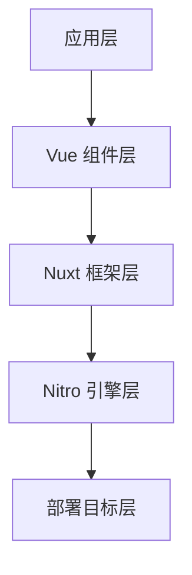

## Nuxt 框架概述

**Nuxt** 是一个基于 Vue.js 的现代化全栈 Web 开发框架，致力于让 Web 开发变得直观和高效。它在 Vue 的基础上提供了一套完整的解决方案，包括服务器端渲染、静态站点生成、自动路由、状态管理等功能。

### 核心定位

::alert{icon="lucide:info" color="blue"}
**元框架定位**: Nuxt 是一个 **元框架 (Meta Framework)**，它抽象了复杂的配置和优化工作，让开发者专注于业务逻辑的实现，而不是底层技术的配置。
::

Nuxt 的设计哲学是 **"约定优于配置"**，通过合理的默认设置和文件结构约定，大大降低了项目的复杂度和学习成本。

### 为什么选择 Nuxt？

**Nuxt4** 是基于 Vue 3 的全栈框架，专为现代Web应用而设计：

- **🚀 性能优异**: 内置 Vite 构建工具，开发体验极佳，构建速度快
- **🔧 开箱即用**: 零配置启动，约定优于配置，减少样板代码
- **🌐 全栈能力**: 前端+后端一体化开发，Nitro 服务器引擎强大
- **📱 现代化**: 支持 SSR、SSG、SPA 等多种渲染模式
- **🔒 类型安全**: 原生 TypeScript 支持，更好的开发体验
- **🎯 SEO友好**: 服务端渲染，搜索引擎优化效果好

### 分层架构

**Nuxt 的分层架构采用模块化设计思想，通过清晰的层级划分实现关注点分离和性能优化**：




#### 1. Vue 组件层 (UI Layer)
- **核心职责**：处理用户界面交互和视图渲染
- **技术特性**：
  - 基于 Vue 3 的组合式 API 开发模式
  - 响应式数据流管理 (Reactivity System)
  - 组件化开发体系 (Component Lifecycle)
  - 支持 Web Components 和跨平台渲染
- **优化方向**：
  - 组件级代码分割 (Code Splitting)
  - 按需加载策略 (Lazy Hydration)
  - 服务端客户端同构 (Isomorphic Rendering)

#### 2. Nuxt 框架层 (Application Layer)
- **核心职责**：提供全栈开发能力与工程化支持
- **技术特性**：
  - 模块化架构 (Module System)
  - 自动导入机制 (Auto-Imports)
  - 文件系统路由 (Filesystem Routing)
  - 统一状态管理 (State Management)
  - 插件扩展系统 (Plugin System)
- **优化方向**：
  - 智能构建优化 (Tree Shaking)
  - 开发体验优化 (HMR/DevTools)
  - 类型安全支持 (TypeScript Integration)

#### 3. Nitro 引擎层 (Server Engine)
- **核心职责**：处理服务端逻辑和资源优化
- **技术特性**：
  - 混合渲染模式 (Hybrid Rendering)
  - API 路由系统 (Server Routes)
  - 部署适配器 (Deploy Presets)
  - 边缘计算支持 (Edge Compatibility)
- **优化方向**：
  - 服务端缓存策略 (Response Caching)
  - 资源压缩优化 (Brotli/Gzip)
  - 安全防护机制 (Security Headers)

#### 4. 运行时层 (Runtime Layer)
- **核心职责**：适配不同部署环境
- **技术矩阵**：
  ```typescript
  // 部署目标配置示例
  export default defineNuxtConfig({
    nitro: {
      preset: 'vercel-edge' // 支持 20+ 部署方案
    },
    experimental: {
      payloadExtraction: true // 静态资源优化
    }
  })
  ```

#### 架构优势对比

| 架构层        | 传统方案痛点               | Nuxt 解决方案               | 性能提升指标       |
|-------------|-----------------------|--------------------------|--------------|
| **组件层**    | 客户端渲染白屏问题           | 服务端激活 (Hydration)       | LCP 提升 40%  |
| **框架层**    | 配置复杂度高              | 约定式配置 (Convention)      | 开发效率提升 60% |
| **引擎层**    | 服务端资源利用率低           | 自动缓存策略 (Auto-Caching)  | TTFB 减少 70% |
| **运行时层**  | 部署环境适配成本高           | 统一构建输出 (Universal Build) | 部署时间减少 80% |

::alert{icon="lucide:git-branch" color="green"}
**架构设计原则**：
1. **渐进增强**：从静态生成到动态渲染的平滑过渡
2. **同构渲染**：服务端与客户端的代码复用
3. **按需加载**：基于路由的代码分割策略
4. **边缘优先**：优先使用 CDN 边缘计算能力
5. **开发优先**：保持优秀的开发体验 (DX)
::

## Nuxt 核心特性

### 自动化系统

Nuxt 的最大优势在于其强大的自动化能力，减少了大量重复性的配置工作：

::card-group{cols=2}
  ::::card{icon="lucide:magic-wand"}
  #title
  **自动导入**
  #description
  自动发现和导入组件、组合式函数、工具函数，无需手动 import
  ::::

  ::::card{icon="lucide:route"}
  #title
  **文件系统路由**
  #description
  基于文件结构自动生成路由，支持动态路由、嵌套路由、布局系统
  ::::

  ::::card{icon="lucide:zap"}
  #title
  **性能优化**
  #description
  自动代码分割、懒加载、预获取，无需手动配置性能优化
  ::::

  ::::card{icon="lucide:shield-check"}
  #title
  **类型安全**
  #description
  端到端类型推断，自动生成类型定义，提供完整的 TypeScript 支持
  ::::
::

### 渲染模式

Nuxt 支持多种渲染策略，可以根据不同场景选择最优方案：

::card-group{cols=2}
  ::::card{icon="lucide:server"}
  #title
  **服务器端渲染 (SSR)**
  #description
  - 更好的 SEO 表现
  - 快速的首屏加载
  - 适合动态内容
  ::::

  ::::card{icon="lucide:file"}
  #title
  **静态站点生成 (SSG)**
  #description
  - 构建时预渲染
  - CDN 分发部署
  - 适合静态内容
  ::::

  ::::card{icon="lucide:monitor"}
  #title
  **客户端渲染 (CSR)**
  #description
  - 纯浏览器渲染
  - 丰富的交互体验
  - 适合后台应用
  ::::

  ::::card{icon="lucide:layers"}
  #title
  **混合渲染**
  #description
  - 按路由配置渲染模式
  - 灵活的渲染策略
  - 最佳性能平衡
  ::::
::


::tabs{variant="pill"}
  ::div{label="SSR 服务器渲染"}
  **服务器端渲染** - 在服务器上预先渲染页面,提供更好的SEO和首屏加载速度。

  **流程说明**:
  1. 客户端请求页面
  2. 服务器执行 Vue 组件
  3. 生成完整的 HTML
  4. 返回给客户端
  5. 客户端激活 (hydration)

  ```typescript
  export default defineNuxtConfig({
    ssr: true, // 默认开启 SSR
    routeRules: {
      '/': { prerender: true }, // 预渲染首页
      '/blog/**': { isr: 3600 }, // 增量静态再生
      '/admin/**': { ssr: false } // 客户端渲染
    }
  });
  ```
  ::

  ::div{label="SSG 静态生成"}
  **静态站点生成** - 在构建时预渲染所有页面,适合内容驱动的网站。

  **流程说明**:
  1. 构建时预渲染所有页面
  2. 生成静态 HTML 文件
  3. 部署到 CDN 或静态托管
  4. 客户端直接获取静态文件

  ```typescript
  export default defineNuxtConfig({
    nitro: {
      prerender: {
        routes: ['/about', '/blog/*'],
        ignore: ['/admin/**']
      }
    }
  });
  ```
  ::

  ::div{label="SPA 单页应用"}
  **单页应用** - 在浏览器中完全渲染,适合高交互性的应用。

  **流程说明**:
  1. 客户端下载 JavaScript 包
  2. 在浏览器中执行 Vue 应用
  3. 动态渲染页面内容
  4. 客户端路由切换

  ```typescript
  export default defineNuxtConfig({
    ssr: false, // 关闭服务器渲染
    routeRules: {
      '/dashboard/**': { ssr: false }
    }
  });
  ```
  ::
::

### 全栈开发能力

Nuxt 提供了完整的全栈开发解决方案：

::card-group{cols=2}
  ::::card{icon="lucide:server"}
  #title
  **服务端API集成**
  #description
  - 内置服务器路由系统
  - API 中间件支持
  - 数据库和外部服务集成
  - 类型安全的API开发
  ::::

  ::::card{icon="lucide:database"}
  #title
  **数据获取能力**
  #description
  - `useFetch` 和 `useAsyncData` 组合式函数
  - 自动数据序列化/反序列化
  - 服务端状态管理
  - API 请求缓存
  ::::

  ::::card{icon="lucide:code"}
  #title
  **开发体验优化**
  #description
  - 热模块替换(HMR)
  - 自动导入功能
  - TypeScript 支持
  - 开发调试工具
  ::::

  ::::card{icon="lucide:cloud"}
  #title
  **部署灵活性**
  #description
  - 支持 Serverless 部署
  - Edge Functions 支持
  - Docker 容器化部署
  - 静态站点生成
  ::::
::


::code-group
  ::code-block{label="前端页面" language="vue"}
  ```vue
  <!-- pages/users.vue -->
  <template>
    <div>
      <h1>用户列表</h1>
      <div v-for="user in users" :key="user.id">
        {{ user.name }}
      </div>
    </div>
  </template>

  <script setup>
  // 自动类型推断
  const { data: users } = await useFetch('/api/users');
  </script>
  ```
  ::

  ::code-block{label="后端API" language="typescript"}
  ```typescript
  // server/api/users.get.ts
  export default defineEventHandler(async (event) => {
    // 数据库查询
    const users = await getUsersFromDatabase();

    return users.map(user => ({
      id: user.id,
      name: user.name,
      email: user.email
    }));
  });
  ```
  ::
::


## Nuxt 与 Vue 的关系

### 职责划分

::card-group{cols=2}
  ::::card{icon="lucide:box"}
  #title
  **Vue 3 职责**
  #description
  - 响应式系统核心实现
  - 组件渲染和生命周期
  - 模板编译优化
  - 虚拟 DOM 算法
  - 组合式 API 设计
  ::::

  ::::card{icon="lucide:layers"}
  #title
  **Nuxt 4 职责**
  #description
  - 全栈应用架构设计
  - 自动化路由系统
  - 服务端渲染(SSR)
  - 构建和部署优化
  - 开发体验提升
  ::::
::

### 工作流程对比

::tabs{variant="line"}
  ::stack{label="Vue 开发流程"}
  ```mermaid
  graph LR
    A[组件开发] --> B[状态管理]
    B --> C[路由配置]
    C --> D[手动构建]
    D --> E[部署SPA]
  ```
  
  - 需要手动配置路由
  - 默认客户端渲染
  - 需要额外配置 SSR
  - 构建部署相对复杂
  ::

  ::stack{label="Nuxt 工作流程"}
  ```mermaid
  graph LR
    A[页面开发] --> B[自动路由]
    B --> C[混合渲染]
    C --> D[自动构建]
    D --> E[智能部署]
  ```
  
  - 基于文件的自动路由
  - 默认服务端渲染
  - 智能混合渲染策略
  - 一键部署多环境
  ::
::

### 开发体验提升

::alert{type="info"}
Nuxt 在 Vue 的基础上提供了更好的开发体验：

- **零配置开发**: 无需手动配置 webpack、路由等
- **自动导入**: 组件、组合式函数自动注册
- **类型安全**: 端到端的 TypeScript 支持
- **开发工具**: 内置调试和性能分析工具
::


## Nuxt4 vs Nuxt3 主要变化

### 1. 目录结构变化

::alert{icon="lucide:folder" color="yellow"}
**重要变化**: Nuxt 4 引入了新的 `app/` 目录结构，提供更清晰的项目组织方式。
::

::code-group
  ::code-block{label="Nuxt 3 结构" language="text"}
  ```
  my-nuxt3-app/
  ├── components/
  ├── pages/
  ├── layouts/
  ├── middleware/
  ├── plugins/
  ├── server/
  ├── assets/
  ├── public/
  └── nuxt.config.ts
  ```
  ::

  ::code-block{label="Nuxt 4 结构" language="text"}
  ```
  my-nuxt4-app/
  ├── app/
  │   ├── components/
  │   ├── pages/
  │   ├── layouts/
  │   ├── middleware/
  │   ├── plugins/
  │   ├── utils/
  │   └── router.options.ts
  ├── server/
  ├── assets/
  ├── public/
  └── nuxt.config.ts
  ```
  ::
::

### 2. 性能优化

**构建性能提升**：

| 特性 | Nuxt 3 | Nuxt 4 |
|------|--------|--------|
| **构建速度** | 基础优化 | 增量构建 + 缓存优化 |
| **开发服务器** | 快速启动 | 毫秒级启动 |
| **热更新** | 标准 HMR | 智能差量更新 |
| **类型检查** | 可选 | 内置增量类型检查 |

### 3. 新特性

::tabs{variant="line"}
  ::div{label="增强的类型支持"}
  ```typescript
  // Nuxt 4 自动生成更精确的类型
  const { data } = await useFetch('/api/users');
  // data 自动推断为 User[] 类型

  // 路由类型安全
  await navigateTo('/dashboard'); // 编译时路由验证
  ```
  ::

  ::div{label="改进的自动导入"}
  ```typescript
  // Nuxt 4 支持更智能的自动导入
  // 自动导入 utils 目录下的工具函数
  const formattedDate = formatDate(new Date());

  // 自动导入第三方库的常用函数
  const { data } = await useFetch('/api/data');
  ```
  ::

  ::div{label="边缘计算优化"}
  ```typescript
  // Nuxt 4 针对边缘计算环境优化
  export default defineNuxtConfig({
    nitro: {
      preset: 'cloudflare-workers',
      experimental: {
        wasm: true // WebAssembly 支持
      }
    }
  });
  ```
  ::
::

### 4. 向后兼容性

::alert{icon="lucide:shield-check" color="green"}
**平滑升级**: Nuxt 4 保持了良好的向后兼容性，大部分 Nuxt 3 项目可以平滑升级。
::

**升级指南**：

1. **渐进式升级** - 支持逐步迁移到新的目录结构
2. **配置兼容** - 现有配置文件无需大幅修改
3. **API 稳定** - 核心 API 保持兼容
4. **迁移工具** - 提供自动化迁移脚本


## Nuxt 发展历程

让我们回顾 Nuxt.js 的重要发展节点：

| 时间 | 版本 | 主要特性 |
|------|------|----------|
| 2016年10月 | **Nuxt.js 1.0 发布** | - 基于 Vue 2.x 和 Webpack 2<br>- 提供基础的 SSR 功能<br>- 引入约定大于配置的理念<br>- 支持自动路由生成 |
| 2018年1月 | **Nuxt.js 2.0 重大更新** | - 升级到 Vue 2.5+ 和 Webpack 4<br>- 引入 Nuxt.js 模块系统<br>- 支持 TypeScript<br>- 性能显著提升<br>- 增强的开发体验 |
| 2021年8月 | **Nuxt 3 Beta 发布** | - 基于 Vue 3 和 Vite<br>- 全新的 Nitro 服务器引擎<br>- 支持 Composition API<br>- 更好的 TypeScript 支持 |
| 2022年11月 | **Nuxt 3 正式发布** | - 生产就绪的稳定版本<br>- 全面的生态系统支持<br>- 企业级特性完善<br>- 社区模块丰富 |
| 2024年6月 | **Nuxt 3.12 发布** | - 为 Nuxt 4 做准备<br>- 引入 `compatibilityVersion: 4` 测试功能<br>- 性能优化和开发体验改进<br>- 内置无障碍功能增强 |
| 2025年4月 | **Nuxt 3.17 发布** | - 数据获取层重大改进<br>- 新的内置组件<br>- 更好的类型安全<br>- 性能持续优化 |
| 2025年6月 | **Nuxt 4 Alpha 发布** | - 🚀 全新的目录结构 (app/ 目录)<br>- 🔄 改进的数据获取机制<br>- 🏷️ 一致的组件命名<br>- 📄 增强的头部管理<br>- ⚡ 准备采用 Vite Environment API |


## Nuxt 生态概览

### 1. 官方生态

Nuxt 拥有丰富的官方维护模块：

::code-group
  ::code-block{label="核心模块" language="typescript"}
  ```typescript
  export default defineNuxtConfig({
    modules: [
      '@nuxt/content', // 内容管理系统
      '@nuxt/image', // 图像优化
      '@nuxt/devtools', // 开发者工具
      '@nuxt/ui', // UI 组件库
      '@nuxt/eslint' // 代码规范
    ]
  });
  ```
  ::

  ::code-block{label="集成模块" language="typescript"}
  ```typescript
  export default defineNuxtConfig({
    modules: [
      '@pinia/nuxt', // 状态管理
      '@vueuse/nuxt', // 组合式函数
      '@nuxtjs/tailwindcss', // CSS 框架
      '@nuxtjs/color-mode', // 主题切换
      '@nuxtjs/google-fonts' // 字体优化
    ]
  });
  ```
  ::
::

### 2. 社区生态

**活跃的开发者社区**：

- **🌟 GitHub Stars**: 50k+ 活跃开发者
- **📦 NPM 模块**: 200+ 官方和社区模块
- **🏢 企业采用**: 全球 1000+ 企业在生产环境使用
- **🎓 学习资源**: 完善的文档和教程体系

### 3. 部署平台支持

Nuxt 支持多种部署环境：

::tabs{variant="pill"}
  ::div{label="无服务器"}
  ```typescript
  // Vercel, Netlify, Cloudflare 等
  export default defineNuxtConfig({
    nitro: {
      preset: 'vercel-edge'
    }
  });
  ```
  ::

  ::div{label="容器化"}
  ```typescript
  // Docker, Kubernetes 等
  export default defineNuxtConfig({
    nitro: {
      preset: 'node-server'
    }
  });
  ```
  ::

  ::div{label="静态托管"}
  ```typescript
  // GitHub Pages, CDN 等
  export default defineNuxtConfig({
    nitro: {
      prerender: {
        routes: ['/']
      }
    }
  });
  ```
  ::
::


## Nuxt 适用场景

### 1. 内容驱动网站

::card-group{cols=2}
  ::::card{icon="lucide:file-text"}
  #title
  **企业官网**
  #description
  - 优秀的 SEO 表现
  - 快速的页面加载
  - 易于维护的内容管理
  ::::

  ::::card{icon="lucide:newspaper"}
  #title
  **博客和媒体站点**
  #description
  - 静态生成优化
  - 丰富的内容组件
  - 搜索引擎友好
  ::::
::

**典型实现**：

```vue
<!-- pages/blog/[slug].vue -->
<template>
  <article>
    <h1>{{ post.title }}</h1>
    <ContentRenderer :value="post" />
  </article>
</template>

<script setup>
const { slug } = useRoute().params;
const { data: post } = await useAsyncData('post', () =>
  queryContent('blog').where({ slug }).findOne());
</script>
```

### 2. 电商应用

::card-group{cols=2}
  ::::card{icon="lucide:shopping-cart"}
  #title
  **在线商城**
  #description
  - 高性能的商品展示
  - 优化的用户体验
  - 完整的购物流程
  ::::

  ::::card{icon="lucide:credit-card"}
  #title
  **支付集成**
  #description
  - 安全的支付处理
  - 多平台部署
  - 实时库存管理
  ::::
::

### 3. 企业级应用

::card-group{cols=2}
  ::::card{icon="lucide:building"}
  #title
  **后台管理系统**
  #description
  - 复杂的用户权限
  - 丰富的数据可视化
  - 高效的开发体验
  ::::

  ::::card{icon="lucide:database"}
  #title
  **数据分析平台**
  #description
  - 实时数据处理
  - 交互式图表
  - 多用户协作
  ::::
::

### 4. 创意和作品集网站

::card-group{cols=2}
  ::::card{icon="lucide:palette"}
  #title
  **设计师作品集**
  #description
  - 精美的视觉效果
  - 流畅的交互体验
  - 移动端优化
  ::::

  ::::card{icon="lucide:camera"}
  #title
  **摄影网站**
  #description
  - 图像优化和懒加载
  - 画廊和展示功能
  - 社交媒体集成
  ::::
::

### 5. 移动优先应用

::alert{icon="lucide:smartphone" color="green"}
**PWA 支持**: Nuxt 提供完整的渐进式 Web 应用支持，可以构建接近原生应用体验的 Web 应用。
::

```typescript
// nuxt.config.ts
export default defineNuxtConfig({
  modules: ['@vite-pwa/nuxt'],
  pwa: {
    registerType: 'autoUpdate',
    workbox: {
      globPatterns: ['**/*.{js,css,html,png,svg,ico}']
    },
    client: {
      installPrompt: true
    }
  }
});
```

### 选择 Nuxt 的判断标准

| 项目需求 | 推荐程度 | 理由 |
|----------|----------|------|
| **SEO 重要** | ⭐⭐⭐⭐⭐ | 服务器端渲染天然优势 |
| **快速开发** | ⭐⭐⭐⭐⭐ | 约定优于配置，开箱即用 |
| **全栈需求** | ⭐⭐⭐⭐⭐ | 统一的前后端开发体验 |
| **性能要求高** | ⭐⭐⭐⭐⭐ | 自动化的性能优化 |
| **团队协作** | ⭐⭐⭐⭐ | 标准化的项目结构 |
| **简单静态页面** | ⭐⭐⭐ | 可能过于复杂 |

---

## 总结

Nuxt 作为现代 Web 开发的集大成者，不仅继承了 Vue 生态的所有优势，更在开发体验、性能优化和部署灵活性方面实现了突破。无论是构建内容驱动的网站、复杂的企业级应用，还是创新的移动优先应用，Nuxt 都能提供完整而高效的解决方案。

通过深入理解 Nuxt 的核心概念、特性和适用场景，开发者可以做出明智的技术选择，并充分利用框架的强大能力来构建出色的 Web 应用程序。

