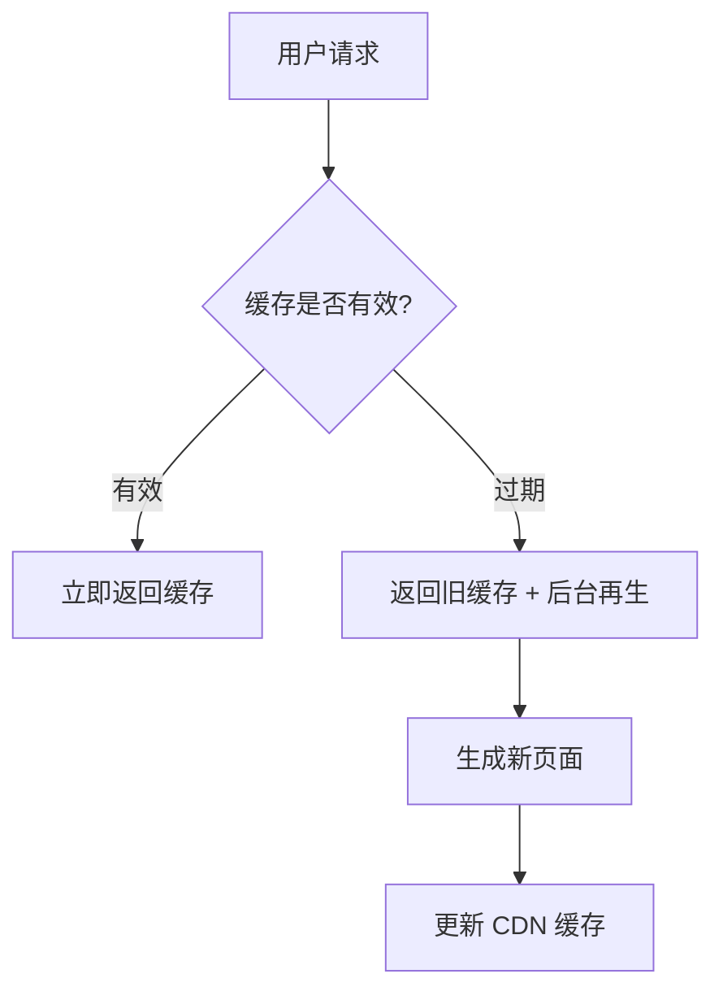

## 概述

现代 Web 应用的性能优化是决定用户体验和业务成功的关键因素。Nuxt 框架基于强大的 Nitro 引擎，提供了多种渲染模式和优化策略，从传统的服务端渲染到现代的混合渲染，每种模式都有其独特的适用场景和性能特点。本文将深度解析这些渲染模式的工作原理，并提供生产级的优化策略。

### 🎯 核心目标

- 深入理解不同渲染模式的技术原理和性能特点
- 掌握混合渲染策略的配置和最佳实践
- 学会构建高效的缓存策略和边缘渲染方案
- 掌握性能监控和优化的实用技巧

### 💡 技术架构

- **Nitro 引擎**: 提供统一的服务端运行时和优化机制
- **混合渲染**: 支持多种渲染模式的灵活组合
- **边缘计算**: 利用 CDN 和 Edge 网络提升全球性能
- **智能缓存**: 多层次缓存策略和失效机制

::alert{icon="lucide:lightbulb" color="blue"}
**架构理念**: Nuxt 的渲染策略基于 "渐进式优化" 原则，允许根据具体需求选择最适合的渲染模式，并可以在同一应用中混合使用不同策略。
::

## SSR(服务端) 渲染模式

### SSR 工作原理

服务端渲染是 Nuxt 的核心特性之一，它在服务器上执行 Vue 组件，生成完整的 HTML 响应。

#### 技术实现机制


 1. **请求处理阶段**: Node.js 服务器接收 HTTP 请求，解析请求 URL 和 headers，创建实例初始化 Nuxt 上下文 (context)
 
 2. **应用实例化**: 创建隔离的 Vue 应用实例，注入 Nuxt 运行时上下文，初始化路由匹配系统，加载页面级组件和布局
 
 3. **数据预取阶段**: 执行页面组件的 asyncData 方法，处理 useFetch/useAsyncData 数据请求，实现请求级缓存（当配置 cache 策略时）

4. **HTML 生成阶段**: 调用 renderToString 进行组件渲染，处理服务端 only 的组件逻辑，收集 head 元信息（通过 useHead），生成最终 HTML 结构
 
5. **客户端激活阶段**: 在 HTML 中嵌入序列化的 Store 状态，注入客户端 hydration 脚本，添加性能监控埋点，实现渐进式 hydration 策略
 
 **关键优化机制**:
 - 组件级缓存 (Component Caching)
 - 流式渲染 (Streaming Rendering)
 - 选择性 hydration (Selective Hydration)
 - 请求级内存管理 (Request-scoped Memory)


```typescript
// SSR 渲染流程示例
export default defineEventHandler(async (event) => {
  // 1. 接收客户端请求
  const url = getRequestURL(event)
  const path = url.pathname
  
  // 2. 创建 Vue 应用实例
  const { vueApp, head } = await createSSRApp({
    url: path,
    route: parseURL(path)
  })
  
  // 3. 服务端渲染
  const appHTML = await renderToString(vueApp)
  
  // 4. 生成完整 HTML
  const html = `
    <!DOCTYPE html>
    <html ${head.htmlAttrs}>
      <head>${head.headTags}</head>
      <body ${head.bodyAttrs}>
        <div id="__nuxt">${appHTML}</div>
        <script>window.__NUXT__=${JSON.stringify(nuxtState)}</script>
        ${head.bodyTags}
      </body>
    </html>
  `
  
  return html
})

// 页面组件中的 SSR 数据获取
<script setup lang="ts">
// 服务端和客户端都会执行
const { data: posts } = await useFetch('/api/posts', {
  key: 'posts-list',
  server: true, // 确保在服务端执行
  transform: (data: any) => {
    return data.posts.map(post => ({
      id: post.id,
      title: post.title,
      publishedAt: new Date(post.published_at)
    }))
  }
})

// 仅在服务端执行的逻辑
if (process.server) {
  console.log('运行在服务端，可以访问 Node.js API')
  // 设置服务端特定的响应头
  setResponseHeader(event, 'Cache-Control', 'max-age=3600')
}
</script>
```

### SSR 性能优化策略

#### 1. 多级缓存策略
```typescript
// 服务端缓存示例（配合Nitro存储）
const { data } = await useAsyncData('cachedData',
  () => $fetch('/api/heavy-data'),
  {
    getCachedData(key) {
      return useStorage().getItem(key) // 使用Nitro存储引擎
    },
    maxAge: 60 * 5 // 5分钟缓存
  }
)

// 组件级缓存（v3.4+）
defineComponent({
  name: 'HeavyComponent',
  serverCacheKey: props => props.id, // 基于props的缓存键
  setup(props) { /* ... */ }
})
```

#### 2. 智能代码分割
```typescript
// 动态导入重型组件
const HeavyChart = defineAsyncComponent({
  loader: () => import('./HeavyChart.vue'),
  delay: 200, // 延迟加载时间
  suspensible: true // 支持Suspense
})

// 路由级分割
export default defineNuxtRouteMiddleware(() => {
  const route = useRoute()
  if (route.path.startsWith('/dashboard')) {
    useHead({ script: [{ src: '/js/dashboard-chunk.js', defer: true }] })
  }
})
```

#### 3. 流式渲染优化
```typescript
// 启用Nitro流式响应
export default defineNitroConfig({
  renderer: process.env.NUXT_STREAMING ? 'stream' : 'default'
})

// 组件中使用Suspense边界
<template>
  <Suspense timeout="500">
    <template #default>
      <AsyncComponent />
    </template>
    <template #fallback>
      <LoadingSkeleton />
    </template>
  </Suspense>
</template>
```

#### 4. 资源优化策略
```typescript
// 关键CSS内联
useHead({
  style: [{
    innerHTML: () => extractCriticalCSS(app)
  }]
})

// 智能预加载
const router = useRouter()
router.beforeEach((to) => {
  if (to.meta.preload) {
    preloadComponents(to.matchedComponents())
  }
})
```

#### 5. 并发与批处理
```typescript
// API请求批处理
const { data: user, data: posts } = await Promise.all([
  useAsyncData('user', () => $fetch('/api/user')),
  useAsyncData('posts', () => $fetch('/api/posts'))
])

// 数据库查询优化（服务端）
if (process.server) {
  const [user, notifications] = await Promise.all([
    db.user.findUnique({ where: { id: userId } }),
    db.notification.findMany({ where: { userId } })
  ])
}
```

#### 6. nuxt 配置优化

```typescript
// 高级 SSR 优化配置
// nuxt.config.ts
export default defineNuxtConfig({
  ssr: true,
  
  // Nitro SSR 优化
  nitro: {
    // 压缩响应
    compressPublicAssets: true,
    
    // 预渲染配置
    prerender: {
      // 智能爬取策略
      crawlLinks: true,
      // 并发预渲染
      concurrency: 10,
      // 忽略特定路由
      ignore: ['/admin', '/api'],
      // 自定义预渲染逻辑
      routes: ['/sitemap.xml']
    },
    
    // 存储配置（用于缓存）
    storage: {
      cache: {
        driver: 'redis',
        host: process.env.REDIS_HOST,
        port: parseInt(process.env.REDIS_PORT),
        db: 0
      }
    }
  },
  
  // 路由级 SSR 配置
  routeRules: {
    // 首页预渲染
    '/': { prerender: true },
    // 动态内容使用 SSR
    '/posts/**': { ssr: true },
    // API 路由优化
    '/api/**': { 
      cors: true,
      headers: { 'Cache-Control': 's-maxage=60' }
    }
  }
})
```

#### 7. 组件级 SSR 优化
```ts
<script setup lang="ts">
// 条件性 SSR
const route = useRoute()
const isPreview = route.query.preview === 'true'

const { data: content } = await useFetch('/api/content', {
  // 预览模式禁用服务端缓存
  server: !isPreview,
  key: isPreview ? undefined : 'content-cache',
  // 缓存控制
  getCachedData: (key) => {
    if (isPreview) return null
    return nuxtApp.ssrContext?.cache?.[key] ?? nuxtApp.payload.data[key]
  }
})
</script>
```

#### 最佳实践原则
1. **按需水合**：对非关键组件使用`<ClientOnly>`或`useHydration`
2. **内存管理**：服务端及时释放大对象，避免内存泄漏
3. **缓存分层**：结合CDN边缘缓存、服务端内存缓存和持久化缓存
4. **渐进增强**：核心内容SSR + 非关键功能CSR
5. **健康检查**：实现`/health`端点监控SSR服务状态

### SSR 错误处理和降级

```typescript
// 健壮的 SSR 错误处理
// server/api/posts.get.ts
export default defineEventHandler(async (event) => {
  try {
    // 设置超时
    const controller = new AbortController()
    const timeoutId = setTimeout(() => controller.abort(), 5000)
    
    const posts = await fetch('https://api.example.com/posts', {
      signal: controller.signal
    }).then(res => res.json())
    
    clearTimeout(timeoutId)
    
    return {
      success: true,
      data: posts
    }
  } catch (error) {
    // 降级策略
    console.error('SSR 数据获取失败:', error)
    
    // 返回缓存数据或默认数据
    const cachedData = await getCachedPosts()
    if (cachedData) {
      return {
        success: true,
        data: cachedData,
        fromCache: true
      }
    }
    
    // 最终降级到空状态
    return {
      success: false,
      data: [],
      error: 'Failed to fetch posts'
    }
  }
})

// 客户端降级处理
<script setup lang="ts">
const { data: posts, error, pending } = await useFetch('/api/posts')

// 错误边界处理
if (error.value) {
  // 客户端重试机制
  const retryCount = ref(0)
  const maxRetries = 3
  
  const retry = async () => {
    if (retryCount.value < maxRetries) {
      retryCount.value++
      await refresh()
    }
  }
  
  // 自动重试
  setTimeout(retry, 1000 retryCount.value)
}
</script>
```

## CSR（客户端）渲染模式

### CSR 工作原理

CSR 模式将应用渲染完全交由客户端处理，服务器仅提供初始 HTML 和静态资源。这种模式适用于需要复杂客户端交互的管理后台、仪表盘等应用场景。

#### 技术实现流程

1. **服务端阶段**：
   - 返回基础 HTML 骨架（包含 `<div id="__nuxt"></div>` 占位）
   - 注入客户端打包的 JavaScript 文件
   - 包含初始化的应用配置和元数据

2. **客户端阶段**：
   - 解析并执行 JavaScript 入口文件
   - 初始化 Vue 应用实例
   - 创建 Vue Router 实例并匹配当前路由
   - 执行页面组件的 `setup()` 和生命周期钩子
   - 通过 DOM 操作将 Vue 组件挂载到占位元素

**核心特性**：
- 客户端路由导航（基于 History API 或 Hash 模式）
- 动态代码分割（按需加载页面组件）
- 客户端状态持久化（通过 Pinia 或 Vuex）
- 渐进式 Hydration（优化大型组件树的交互时间）

```typescript
// CSR 模式基础配置
// nuxt.config.ts
export default defineNuxtConfig({
  ssr: false, // 关键配置项
  
  app: {
    // 客户端路由配置
    keepalive: true,
    layoutTransition: { 
      name: 'layout', 
      mode: 'out-in' 
    }
  },
  
  // 客户端优化配置
  experimental: {
    payloadExtraction: false, // 禁用预加载 payload
    clientFallback: true      // 启用客户端降级策略
  }
})

// 客户端初始化流程示例
// app.vue
<script setup lang="ts">
onMounted(() => {
  // 客户端初始化逻辑
  const nuxtApp = useNuxtApp()
  
  // 注册客户端插件
  nuxtApp.hook('app:created', (vueApp) => {
    vueApp.use(SomeClientOnlyPlugin)
  })
  
  // 性能监控
  if (process.client) {
    const { trackPageView } = useAnalytics()
    trackPageView()
  }
})
</script>
```

#### 生命周期关键节点
1. **资源加载**：浏览器解析 HTML 并加载 JS/CSS
2. **应用初始化**：创建 Vue 实例和路由系统
3. **路由匹配**：根据当前 URL 匹配对应页面组件
4. **数据获取**：执行 `useFetch`/`useAsyncData`
5. **组件渲染**：生成 Virtual DOM 并挂载到真实 DOM
6. **Hydration**：将 Vue 响应式系统绑定到现有 DOM

::alert{icon="lucide:alert-circle" color="amber"}
**性能注意点**：CSR 模式需要特别注意首屏加载性能优化，建议配合代码分割、预加载关键资源、骨架屏等技术使用。
::


### CSR 优化策略

#### 1. 代码分割与懒加载
```typescript
// 动态路由组件加载
const router = useRouter()
router.beforeEach((to) => {
  // 预加载目标路由组件
  import(`~/pages/${to.name}.vue`).catch(() => {})
})

// 按需加载第三方库
const loadHeavyLibrary = () => import('heavy-library').then(({ init }) => init())
```

#### 2. 智能预取策略
```typescript
// nuxt.config.ts
export default defineNuxtConfig({
  experimental: {
    // 预取视口内链接
    payloadPrefetch: true,
    // 预渲染关键路径
    prerenderRoutes: ['/landing', '/pricing']
  }
})

// 手动触发预加载
usePreloadRoutes(['/checkout', '/dashboard'])
```

#### 3. 缓存优化策略
```typescript
// 客户端数据缓存
const { data } = useFetch('/api/products', {
  key: 'products',
  getCachedData(key) {
    return useNuxtApp().payload.data[key] || useState(key).value
  }
})

// Service Worker 缓存策略
if (process.client) {
  navigator.serviceWorker.register('/sw.js', {
    type: 'module',
    scope: '/'
  })
}
```

#### 4. 关键渲染路径优化
```typescript
// 首屏关键CSS内联
useHead({
  style: [{
    innerHTML: `/* 关键CSS */`
  }]
})

// 延迟非关键资源
const nonCriticalStyles = [
  'https://cdn.example.com/non-critical.css'
]
onMounted(() => loadStyles(nonCriticalStyles))
```

#### 5. 性能监控与优化
```typescript
// 性能指标收集
const { metric } = useWebVitals()
onMounted(() => {
  metric((data) => {
    sendToAnalytics(data)
  })
})

// 长任务监控
const observer = new PerformanceObserver((list) => {
  for (const entry of list.getEntries()) {
    console.log('Long task:', entry)
  }
})
observer.observe({ entryTypes: ['longtask'] })
```

::alert{icon="lucide:alert-triangle" color="blue"}
**优化建议**：
- 使用 `v-lazy` 指令实现图片懒加载
- 对静态资源启用 Brotli 压缩
- 采用 `Intersection Observer` 实现元素可见时加载
- 使用 `useIdleCallback` 处理非关键任务
- 定期进行 Lighthouse 性能审计
::

#### nuxt 优化配置

```typescript
// 高性能 CSR 配置
// nuxt.config.ts
export default defineNuxtConfig({
  ssr: false, // 全局 CSR 模式
  
  // CSR 特定优化
  app: {
    // 启用客户端路由
    keepalive: true,
    // 页面过渡动画
    pageTransition: { 
      name: 'page', 
      mode: 'out-in',
      // 避免 FOUC
      appear: true
    }
  },
  
  // Vite 优化配置
  vite: {
    build: {
      // 代码分割策略
      rollupOptions: {
        output: {
          manualChunks: {
            // 分离第三方库
            vendor: ['vue', 'vue-router'],
            // 分离 UI 库
            ui: ['@headlessui/vue', '@heroicons/vue'],
            // 分离工具库
            utils: ['lodash-es', 'date-fns']
          }
        }
      },
      // 启用压缩
      minify: 'terser',
      terserOptions: {
        compress: {
          drop_console: true,
          drop_debugger: true
        }
      }
    },
    
    // 开发时的模块热替换
    server: {
      hmr: {
        overlay: false
      }
    }
  }
})

// 路由级 CSR 配置
export default defineNuxtConfig({
  routeRules: {
    // 管理后台使用 CSR
    '/admin/**': { ssr: false },
    // 用户仪表板使用 CSR
    '/dashboard/**': { 
      ssr: false,
      prerender: false,
      index: false // 不被搜索引擎索引
    }
  }
})
```

#### CSR 懒加载和代码分割

```vue
<!-- 组件级懒加载 -->
<script setup lang="ts">
// 动态导入组件
const HeavyChart = defineAsyncComponent(() => 
  import('~/components/HeavyChart.vue')
)

const UserDashboard = defineAsyncComponent({
  loader: () => import('~/components/UserDashboard.vue'),
  // 加载状态
  loadingComponent: () => h('div', '加载中...'),
  // 错误状态
  errorComponent: () => h('div', '加载失败'),
  // 延迟显示加载状态
  delay: 200,
  // 超时时间
  timeout: 10000
})

// 条件性懒加载
const showChart = ref(false)
const ChartComponent = computed(() => {
  return showChart.value 
    ? defineAsyncComponent(() => import('~/components/Chart.vue'))
    : null
})

// 路由级懒加载
const router = useRouter()

// 预加载下一个可能的路由
const preloadRoute = (path: string) => {
  router.resolve(path).then(resolved => {
    // 预加载路由组件
    resolved.matched.forEach(record => {
      if (record.components) {
        Object.values(record.components).forEach(component => {
          if (typeof component === 'function') {
            component()
          }
        })
      }
    })
  })
}

// 智能预加载
onMounted(() => {
  // 用户可能访问的路径
  const likelyPaths = ['/dashboard', '/profile', '/settings']
  
  // 延迟预加载，避免影响首屏性能
  setTimeout(() => {
    likelyPaths.forEach(preloadRoute)
  }, 2000)
})
</script>

<template>
  <div>
    <!-- 条件渲染懒加载组件 -->
    <Suspense>
      <template #default>
        <HeavyChart v-if="showChart" />
      </template>
      <template #fallback>
        <div class="animate-pulse bg-gray-200 h-64 rounded"></div>
      </template>
    </Suspense>
    
    <!-- 异步组件 -->
    <UserDashboard />
  </div>
</template>
```

## SSG 渲染模式

SSG 渲染模式在构建时预生成静态 HTML 文件，适用于内容相对固定的场景（如博客、文档站点、营销页面等），具有极致的加载性能和 SEO 友好特性。

### SSG 工作原理

#### 技术实现流程

1. **构建阶段**：
   - 解析路由配置生成路由映射表
   - 并行执行页面组件的 asyncData/useAsyncData
   - 使用 Vue 服务端渲染器生成静态 HTML
   - 自动处理动态路由参数（需配置 generate.routes）

2. **部署阶段**：
   - 将生成的 dist 目录部署到 CDN 或静态托管服务
   - 自动生成 _nuxt 静态资源目录
   - 生成 sitemap.xml 和 robots.txt（需配置模块）

3. **运行时阶段**：
   - 直接返回预生成的 HTML 文件
   - 客户端激活 Vue 响应式系统
   - 处理后续客户端导航（通过 vue-router）

```typescript
// SSG 基础配置
// nuxt.config.ts
export default defineNuxtConfig({
  ssr: true, // 必须启用 SSR
  target: 'static', // 关键配置项
  
  generate: {
    cache: false, // 禁用构建缓存
    concurrency: 10, // 并行生成任务数
    interval: 1000, // 任务间隔时间(ms)
    routes: ['/dynamic/1', '/dynamic/2'] // 动态路由预生成
  },
  
  // 静态资源优化
  nitro: {
    prerender: {
      crawlLinks: true, // 自动爬取链接预生成
      routes: ['/sitemap.xml'] // 特殊文件生成
    }
  }
})

// 动态路由生成示例
// nuxt.config.ts
export default defineNuxtConfig({
  generate: {
    async routes() {
      const posts = await fetch('https://api.example.com/posts').then(res => res.json())
      return posts.map(post => `/posts/${post.id}`)
    }
  }
})
```

#### 核心优势与限制

**优势**：
- 全球 CDN 可缓存性（Cache-Control: max-age=31536000）
- 完全消除服务端计算开销
- 支持离线访问（配合 Service Worker）
- 天然防御 CSRF/XSS 攻击

**限制**：
- 不适合实时数据场景
- 动态路由需要预生成
- 构建时间随内容量线性增长

### SSG 优化策略

1. **增量生成**：
```typescript
// 增量构建配置
export default defineNuxtConfig({
  experimental: {
    payloadExtraction: true, // 提取页面数据
    incrementalStaticGeneration: {
      enable: true, // 启用增量生成
      background: true // 后台增量更新
    }
  }
})
```

2. **混合缓存策略**：
```typescript
// 服务端路由处理
export default defineEventHandler((event) => {
  setHeader(event, 'Cache-Control', 'public, max-age=3600, stale-while-revalidate=86400')
  return proxyStaticRequest(event)
})
```

3. **资源预加载**：
```vue
<script setup lang="ts">
// 预加载关键数据
const { data } = await useAsyncData('critical-data', () => fetchCriticalData(), {
  preload: true // 在父路由预加载
})
</script>

<template>
  <Link rel="preload" href="/_nuxt/header.css" as="style">
  <Link rel="prefetch" href="/_nuxt/ProductModal.js" as="script">
</template>
```

::alert{icon="lucide:alert-triangle" color="blue"}
**注意事项**：
- 动态内容需通过客户端 hydration 处理
- 大型站点需分批次生成（使用 generate.batch）
- 避免在 asyncData 中使用环境敏感变量
- 定期清理过期静态文件
::


## ISR（增量静态再生）渲染模式

### ISR 工作机制分析

ISR 的核心原理是通过智能缓存策略实现动态内容的增量更新，主要分为以下阶段：

1. **初始生成阶段**
- 构建时生成静态页面（同 SSG）
- 自动缓存到 CDN 边缘节点
- 通过 `prerender` 配置预渲染关键路径

2. **再生触发条件**
- 时间驱动：`ttl` 参数控制缓存有效期（单位：秒）
- 事件驱动：通过 `revalidate()` 方法手动触发再生
- 流量驱动：首次访问过期页面时触发后台再生

3. **请求处理流程**


4. **缓存策略**
- 使用 `stale-while-revalidate` 模式
- 通过 `Cache-Control` 头控制缓存行为
- 支持多级缓存（CDN/Edge/浏览器）

5. **再生过程优化**
- 增量更新：仅修改变化部分
- 并发控制：`concurrency` 限制再生任务数
- 失败降级：再生失败时继续使用旧缓存

6. **动态路由处理**
- 通过 `prerender:routes` 钩子动态添加路由
- 支持基于数据的路由预生成
- 自动处理分页/详情页的缓存关联


ISR 结合了 SSG 的性能优势和 SSR 的灵活性，是现代 Web 应用的理想选择。

#### ISR 配置

```typescript
// ISR 配置和实现
// nuxt.config.ts
export default defineNuxtConfig({
  nitro: {
    // ISR 全局配置
    prerender: {
      // 启用爬取
      crawlLinks: true,
      // 并发限制
      concurrency: 10,
      // 路由生成钩子
      routes: ['/sitemap.xml']
    }
  },
  
  routeRules: {
    // 不同的 ISR 策略
    '/blog/**': { 
      isr: true // 永久缓存，直到手动失效
    },
    '/products/**': { 
      isr: 60 // 60秒后重新生成
    },
    '/news/**': { 
      isr: { ttl: 300, staleWhileRevalidate: true } // 高级 ISR 配置
    }
  },
  
  hooks: {
    // 动态路由生成
    async 'prerender:routes'(ctx) {
      // 从 CMS 获取路由
      const posts = await fetch('https://cms.example.com/posts')
        .then(res => res.json())
      
      // 添加到预渲染队列
      for (const post of posts.data) {
        ctx.routes.add(`/blog/${post.slug}`)
      }
      
      // 分页路由
      const totalPages = Math.ceil(posts.total / 10)
      for (let i = 1; i <= totalPages; i++) {
        ctx.routes.add(`/blog/page/${i}`)
      }
    }
  }
})

// ISR 缓存控制
// server/api/posts/[slug].get.ts
export default defineEventHandler(async (event) => {
  const slug = getRouterParam(event, 'slug')
  
  // 检查缓存键
  const cacheKey = `post:${slug}`
  
  try {
    // 从数据库获取文章
    const post = await getPostBySlug(slug)
    
    if (!post) {
      throw createError({
        statusCode: 404,
        statusMessage: 'Post not found'
      })
    }
    
    // 设置 ISR 缓存头
    setResponseHeaders(event, {
      'Cache-Control': 'public, max-age=60, stale-while-revalidate=3600',
      'CDN-Cache-Control': 'public, max-age=3600',
      'Vercel-CDN-Cache-Control': 'public, max-age=3600'
    })
    
    // 设置 ETag 用于缓存验证
    const etag = generateETag(post)
    setResponseHeader(event, 'ETag', etag)
    
    // 检查客户端缓存
    const clientETag = getRequestHeader(event, 'if-none-match')
    if (clientETag === etag) {
      setResponseStatus(event, 304)
      return
    }
    
    return {
      success: true,
      data: post,
      meta: {
        cached: false,
        generated: new Date().toISOString()
      }
    }
  } catch (error) {
    // 错误处理
    throw createError({
      statusCode: error.statusCode || 500,
      statusMessage: error.message || 'Internal server error'
    })
  }
})
```

#### ISR 缓存失效策略

```typescript
// 智能缓存失效
// server/api/revalidate.post.ts
export default defineEventHandler(async (event) => {
  const body = await readBody(event)
  const { paths, tags } = body
  
  // 验证权限
  const token = getRequestHeader(event, 'authorization')
  if (!await validateRevalidateToken(token)) {
    throw createError({
      statusCode: 401,
      statusMessage: 'Unauthorized'
    })
  }
  
  const revalidated = []
  
  // 路径级失效
  if (paths?.length > 0) {
    for (const path of paths) {
      await invalidatePath(path)
      revalidated.push(path)
    }
  }
  
  // 标签级失效
  if (tags?.length > 0) {
    for (const tag of tags) {
      const taggedPaths = await getPathsByTag(tag)
      for (const path of taggedPaths) {
        await invalidatePath(path)
        revalidated.push(path)
      }
    }
  }
  
  return {
    success: true,
    revalidated: [...new Set(revalidated)],
    timestamp: new Date().toISOString()
  }
})

// CMS Webhook 集成
// server/api/webhook/cms.post.ts
export default defineEventHandler(async (event) => {
  const body = await readBody(event)
  
  // 验证 Webhook 签名
  const signature = getRequestHeader(event, 'x-webhook-signature')
  if (!await validateWebhookSignature(body, signature)) {
    throw createError({
      statusCode: 401,
      statusMessage: 'Invalid signature'
    })
  }
  
  const { event: eventType, data } = body
  
  switch (eventType) {
    case 'post.published':
    case 'post.updated':
      // 失效相关页面
      await Promise.all([
        invalidatePath(`/blog/${data.slug}`),
        invalidatePath('/blog'),
        invalidatePath('/'),
        // 失效相关标签页面
        ...data.tags.map(tag => invalidatePath(`/blog/tag/${tag}`))
      ])
      break
      
    case 'post.deleted':
      await invalidatePath(`/blog/${data.slug}`)
      break
  }
  
  return { success: true }
})
```

## 混合渲染策略

混合渲染是 Nuxt 3 的核心优势，允许在同一应用中使用不同的渲染策略。

#### 高级混合渲染配置

```typescript
// 企业级混合渲染策略
// nuxt.config.ts
export default defineNuxtConfig({
  // 基础混合渲染配置
  routeRules: {
    // 营销页面 - 静态预渲染（SEO 优化）
    '/': { prerender: true },
    '/about': { prerender: true },
    '/contact': { prerender: true },
    '/pricing': { prerender: true },
    
    // 产品页面 - ISR（平衡性能和更新频率）
    '/products': { isr: 300 }, // 5分钟缓存
    '/products/**': { isr: 600 }, // 10分钟缓存
    
    // 博客 - SWR（内容更新频繁）
    '/blog': { swr: 60 }, // 1分钟缓存
    '/blog/**': { swr: 120 }, // 2分钟缓存
    
    // 用户相关 - SSR（个性化内容）
    '/profile/**': { ssr: true },
    '/orders/**': { ssr: true },
    
    // 管理后台 - CSR（复杂交互）
    '/admin/**': { 
      ssr: false,
      prerender: false,
      index: false,
      robots: false
    },
    
    // API 路由优化
    '/api/public/**': { 
      cors: true,
      headers: { 'Cache-Control': 'public, max-age=300' }
    },
    '/api/private/**': { 
      headers: { 'Cache-Control': 'private, no-cache' }
    }
  },
  
  // 实验性特性
  experimental: {
    // 服务端组件
    serverComponents: true,
    // 渐进式增强
    noScripts: false
  }
})

// 动态路由规则
// plugins/dynamic-route-rules.client.ts
export default defineNuxtPlugin(() => {
  const router = useRouter()
  
  router.beforeEach((to) => {
    // 根据用户状态动态设置渲染规则
    const user = useAuthUser()
    
    if (to.path.startsWith('/dashboard')) {
      // 已登录用户使用 SSR，未登录用户重定向
      if (!user.value) {
        return navigateTo('/login')
      }
    }
    
    if (to.path.startsWith('/premium')) {
      // 付费用户使用 ISR，免费用户使用 SSG
      const renderRule = user.value?.isPremium ? { isr: 60 } : { prerender: true }
      // 动态应用渲染规则（需要服务端配合）
      setRouteRule(to.path, renderRule)
    }
  })
})
```

#### 条件渲染策略

```vue
<!-- 组件级渲染控制 -->
<script setup lang="ts">
// 根据设备类型选择渲染策略
const { isMobile, isBot } = useDevice()

// 搜索引擎爬虫使用 SSR
if (isBot) {
  defineRouteRules({ ssr: true })
}
// 移动设备使用预渲染
else if (isMobile) {
  defineRouteRules({ prerender: true })
}
// 桌面设备使用 CSR
else {
  defineRouteRules({ ssr: false })
}

// A/B 测试渲染策略
const experiment = useExperiment('rendering-strategy')
switch (experiment.variant) {
  case 'ssr':
    defineRouteRules({ ssr: true })
    break
  case 'isr':
    defineRouteRules({ isr: 60 })
    break
  case 'CSR':
    defineRouteRules({ ssr: false })
    break
}

// 地理位置优化
const { country } = useGeoLocation()
if (['US', 'EU', 'JP'].includes(country)) {
  // 主要市场使用 ISR
  defineRouteRules({ isr: 120 })
} else {
  // 其他地区使用 SSG
  defineRouteRules({ prerender: true })
}
</script>
```

## 渲染优化策略

### 服务器端渲染（SSR）与静态站点生成（SSG）优化

#### 智能预渲染策略

```typescript
// 高级预渲染配置
// nuxt.config.ts
export default defineNuxtConfig({
  nitro: {
    prerender: {
      // 智能爬取配置
      crawlLinks: true,
      // 并发控制
      concurrency: 15,
      // 超时设置
      timeout: 30000,
      // 失败重试
      retry: 3,
      // 忽略规则
      ignore: [
        '/admin',
        '/api',
        '/404',
        '/500',
        '**/*.xml',
        '**/*.json'
      ],
      // 自定义爬取逻辑
      routes: async () => {
        const routes = new Set<string>()
        
        // 从 CMS 获取内容路由
        const cmsRoutes = await fetchCMSRoutes()
        cmsRoutes.forEach(route => routes.add(route))
        
        // 从数据库获取动态路由
        const dbRoutes = await fetchDatabaseRoutes()
        dbRoutes.forEach(route => routes.add(route))
        
        // 生成分页路由
        const paginationRoutes = await generatePaginationRoutes()
        paginationRoutes.forEach(route => routes.add(route))
        
        return Array.from(routes)
      }
    },
    
    // 压缩优化
    compressPublicAssets: {
      gzip: true,
      brotli: true
    },
    
    // 存储引擎配置
    storage: {
      // Redis 缓存
      cache: {
        driver: 'redis',
        ...redisConfig
      },
      // 文件系统缓存
      disk: {
        driver: 'fs',
        base: './.cache'
      }
    }
  }
})

// 预渲染生成器
// scripts/generate-routes.ts
import { $fetch } from 'ofetch'

interface RouteGenerator {
  pattern: string
  generator: () => Promise<string[]>
}

const routeGenerators: RouteGenerator[] = [
  // 博客文章路由
  {
    pattern: '/blog/**',
    generator: async () => {
      const posts = await $fetch('/api/posts')
      return posts.data.map(post => `/blog/${post.slug}`)
    }
  },
  
  // 产品路由
  {
    pattern: '/products/**',
    generator: async () => {
      const products = await $fetch('/api/products')
      const routes = []
      
      // 产品详情页
      routes.push(...products.data.map(p => `/products/${p.slug}`))
      
      // 分类页面
      const categories = [...new Set(products.data.map(p => p.category))]
      routes.push(...categories.map(c => `/products/category/${c}`))
      
      // 品牌页面
      const brands = [...new Set(products.data.map(p => p.brand))]
      routes.push(...brands.map(b => `/products/brand/${b}`))
      
      return routes
    }
  },
  
  // 用户资料页
  {
    pattern: '/users/**',
    generator: async () => {
      const users = await $fetch('/api/users/public')
      return users.data.map(user => `/users/${user.username}`)
    }
  }
]

export async function generateAllRoutes(): Promise<string[]> {
  const allRoutes = []
  
  for (const generator of routeGenerators) {
    try {
      const routes = await generator.generator()
      allRoutes.push(...routes)
      console.log(`Generated ${routes.length} routes for ${generator.pattern}`)
    } catch (error) {
      console.error(`Failed to generate routes for ${generator.pattern}:`, error)
    }
  }
  
  return allRoutes
}
```

#### SSG 性能监控

```typescript
// 预渲染性能监控
// scripts/monitor-prerender.ts
export default defineNuxtConfig({
  hooks: {
    'prerender:start': () => {
      console.log('开始预渲染...')
      startTime = Date.now()
    },
    
    'prerender:route': (route) => {
      const routeStartTime = Date.now()
      routePerformance.set(route.route, { 
        startTime: routeStartTime,
        size: 0 
      })
    },
    
    'prerender:generate': (route, result) => {
      const perf = routePerformance.get(route.route)
      if (perf) {
        perf.duration = Date.now() - perf.startTime
        perf.size = Buffer.byteLength(result.html, 'utf8')
        
        // 性能告警
        if (perf.duration > 5000) {
          console.warn(`⚠️  慢速路由: ${route.route} (${perf.duration}ms)`)
        }
        
        if (perf.size > 500000) {
          console.warn(`⚠️  大文件: ${route.route} (${perf.size} bytes)`)
        }
      }
    },
    
    'prerender:done': () => {
      const totalTime = Date.now() - startTime
      const totalRoutes = routePerformance.size
      
      console.log(`✅ 预渲染完成: ${totalRoutes} 个路由，耗时 ${totalTime}ms`)
      
      // 生成性能报告
      generatePerformanceReport(routePerformance)
    }
  }
})

function generatePerformanceReport(performance: Map<string, any>) {
  const report = {
    total: performance.size,
    average: Array.from(performance.values())
      .reduce((sum, p) => sum + p.duration, 0) / performance.size,
    slowest: Array.from(performance.entries())
      .sort(([,a], [,b]) => b.duration - a.duration)
      .slice(0, 10),
    largest: Array.from(performance.entries())
      .sort(([,a], [,b]) => b.size - a.size)
      .slice(0, 10)
  }
  
  // 保存报告
  writeFileSync('prerender-report.json', JSON.stringify(report, null, 2))
}
```

### 混合渲染（Hybrid）策略

#### 动态路由与静态路由结合

```typescript
// 智能混合渲染策略
// composables/useRenderingStrategy.ts
export const useRenderingStrategy = () => {
  const route = useRoute()
  const user = useAuthUser()
  const device = useDevice()
  
  // 策略决策引擎
  const determineStrategy = () => {
    const strategies = []
    
    // 基于路由模式的策略
    if (route.path.match(/^\/(about|contact|privacy)/)) {
      strategies.push({ mode: 'prerender', priority: 10, reason: 'Static pages' })
    }
    
    if (route.path.match(/^\/blog\//)) {
      strategies.push({ mode: 'isr', ttl: 300, priority: 8, reason: 'Content pages' })
    }
    
    if (route.path.match(/^\/products\//)) {
      strategies.push({ mode: 'swr', ttl: 60, priority: 7, reason: 'Product pages' })
    }
    
    // 基于用户状态的策略
    if (user.value) {
      if (route.path.startsWith('/dashboard')) {
        strategies.push({ mode: 'ssr', priority: 9, reason: 'Personalized content' })
      }
    } else {
      if (route.path.startsWith('/login')) {
        strategies.push({ mode: 'CSR', priority: 6, reason: 'Authentication flow' })
      }
    }
    
    // 基于设备类型的策略
    if (device.isMobile) {
      strategies.push({ mode: 'prerender', priority: 5, reason: 'Mobile optimization' })
    }
    
    // 基于时间的策略
    const hour = new Date().getHours()
    if (hour >= 9 && hour <= 17) {
      // 工作时间更频繁更新
      strategies.forEach(s => {
        if (s.mode === 'isr' || s.mode === 'swr') {
          s.ttl = Math.floor(s.ttl / 2)
        }
      })
    }
    
    // 选择最高优先级策略
    return strategies.sort((a, b) => b.priority - a.priority)[0]
  }
  
  return { determineStrategy }
}

// 应用渲染策略
// plugins/apply-rendering-strategy.server.ts
export default defineNuxtPlugin(async () => {
  const strategy = useRenderingStrategy()
  const selectedStrategy = strategy.determineStrategy()
  
  if (selectedStrategy) {
    console.log(`应用渲染策略: ${selectedStrategy.mode} (${selectedStrategy.reason})`)
    
    // 设置路由规则
    switch (selectedStrategy.mode) {
      case 'prerender':
        defineRouteRules({ prerender: true })
        break
      case 'ssr':
        defineRouteRules({ ssr: true })
        break
      case 'CSR':
        defineRouteRules({ ssr: false })
        break
      case 'isr':
        defineRouteRules({ isr: selectedStrategy.ttl })
        break
      case 'swr':
        defineRouteRules({ swr: selectedStrategy.ttl })
        break
    }
  }
})
```

### 缓存策略优化

#### SWR 与 Cache-Control 配置

```typescript
// 高级缓存策略
// server/middleware/cache-control.ts
export default defineEventHandler(async (event) => {
  const url = getRequestURL(event)
  const path = url.pathname
  
  // 静态资源缓存
  if (path.startsWith('/_nuxt/') || path.match(/\.(js|css|png|jpg|jpeg|gif|svg|webp|woff2?|ttf)$/)) {
    setResponseHeaders(event, {
      'Cache-Control': 'public, max-age=31536000, immutable',
      'CDN-Cache-Control': 'public, max-age=31536000'
    })
    return
  }
  
  // HTML 页面缓存策略
  const cacheStrategies = {
    // 首页 - 短期缓存，频繁更新
    '/': {
      'Cache-Control': 'public, max-age=60, stale-while-revalidate=300',
      'CDN-Cache-Control': 'public, max-age=300'
    },
    
    // 博客文章 - 长期缓存，后台更新
    '/blog/**': {
      'Cache-Control': 'public, max-age=3600, stale-while-revalidate=86400',
      'CDN-Cache-Control': 'public, max-age=86400'
    },
    
    // 产品页面 - 中期缓存
    '/products/**': {
      'Cache-Control': 'public, max-age=1800, stale-while-revalidate=3600',
      'CDN-Cache-Control': 'public, max-age=3600'
    },
    
    // API 路由 - 分级缓存
    '/api/public/**': {
      'Cache-Control': 'public, max-age=300',
      'CDN-Cache-Control': 'public, max-age=600'
    },
    
    '/api/user/**': {
      'Cache-Control': 'private, max-age=60',
      'CDN-Cache-Control': 'private, no-cache'
    }
  }
  
  // 应用缓存策略
  for (const [pattern, headers] of Object.entries(cacheStrategies)) {
    if (matchRoute(path, pattern)) {
      setResponseHeaders(event, headers)
      break
    }
  }
  
  // Vary 头设置
  setResponseHeader(event, 'Vary', 'Accept-Encoding, User-Agent, Accept')
})

// 智能缓存失效
// server/api/cache/invalidate.post.ts
export default defineEventHandler(async (event) => {
  const { paths, tags, conditions } = await readBody(event)
  
  const invalidationResults = []
  
  // 路径级失效
  if (paths?.length > 0) {
    for (const path of paths) {
      await invalidateCacheByPath(path)
      invalidationResults.push({ type: 'path', target: path, success: true })
    }
  }
  
  // 标签级失效
  if (tags?.length > 0) {
    for (const tag of tags) {
      const taggedPaths = await getCachePathsByTag(tag)
      for (const path of taggedPaths) {
        await invalidateCacheByPath(path)
      }
      invalidationResults.push({ 
        type: 'tag', 
        target: tag, 
        affected: taggedPaths.length,
        success: true 
      })
    }
  }
  
  // 条件失效
  if (conditions?.length > 0) {
    for (const condition of conditions) {
      const matchedPaths = await findCachePathsByCondition(condition)
      for (const path of matchedPaths) {
        await invalidateCacheByPath(path)
      }
      invalidationResults.push({
        type: 'condition',
        target: condition,
        affected: matchedPaths.length,
        success: true
      })
    }
  }
  
  return {
    success: true,
    invalidated: invalidationResults,
    timestamp: new Date().toISOString()
  }
})
```

#### 多层缓存架构

```typescript
// 多层缓存实现
// composables/useMultiTierCache.ts
export const useMultiTierCache = () => {
  const storage = useStorage()
  
  interface CacheConfig {
    l1?: { ttl: number; max: number }  // 内存缓存
    l2?: { ttl: number }               // Redis 缓存
    l3?: { ttl: number }               // CDN 缓存
  }
  
  const get = async <T>(key: string, config: CacheConfig = {}): Promise<T | null> => {
    // L1: 内存缓存
    if (config.l1) {
      const l1Cache = await storage.getItem(`l1:${key}`)
      if (l1Cache && Date.now() - l1Cache.timestamp < config.l1.ttl * 1000) {
        return l1Cache.data
      }
    }
    
    // L2: Redis 缓存
    if (config.l2) {
      const l2Cache = await storage.getItem(`l2:${key}`)
      if (l2Cache && Date.now() - l2Cache.timestamp < config.l2.ttl * 1000) {
        // 回填 L1 缓存
        if (config.l1) {
          await storage.setItem(`l1:${key}`, {
            data: l2Cache.data,
            timestamp: Date.now()
          })
        }
        return l2Cache.data
      }
    }
    
    return null
  }
  
  const set = async <T>(key: string, data: T, config: CacheConfig = {}): Promise<void> => {
    const timestamp = Date.now()
    
    // L1: 内存缓存
    if (config.l1) {
      await storage.setItem(`l1:${key}`, { data, timestamp })
    }
    
    // L2: Redis 缓存
    if (config.l2) {
      await storage.setItem(`l2:${key}`, { data, timestamp })
    }
    
    // L3: CDN 缓存通过 HTTP 头控制
    if (config.l3) {
      // 在响应中设置缓存头
      const event = getCurrentEvent()
      if (event) {
        setResponseHeaders(event, {
          'Cache-Control': `public, max-age=${config.l3.ttl}`,
          'CDN-Cache-Control': `public, max-age=${config.l3.ttl}`
        })
      }
    }
  }
  
  const invalidate = async (pattern: string): Promise<void> => {
    // 获取所有匹配的键
    const l1Keys = await storage.getKeys('l1:')
    const l2Keys = await storage.getKeys('l2:')
    
    const matchingKeys = [...l1Keys, ...l2Keys].filter(key => 
      key.includes(pattern) || minimatch(key, pattern)
    )
    
    // 删除匹配的缓存
    await Promise.all(matchingKeys.map(key => storage.removeItem(key)))
    
    // CDN 缓存失效需要通过 API 调用
    await invalidateCDNCache(pattern)
  }
  
  return { get, set, invalidate }
}

// 使用示例
<script setup lang="ts">
const cache = useMultiTierCache()

// 获取带缓存的数据
const getCachedPosts = async () => {
  const cacheKey = 'posts:recent'
  
  let posts = await cache.get(cacheKey, {
    l1: { ttl: 60, max: 100 },    // 1分钟内存缓存
    l2: { ttl: 300 },             // 5分钟 Redis 缓存
    l3: { ttl: 600 }              // 10分钟 CDN 缓存
  })
  
  if (!posts) {
    posts = await $fetch('/api/posts/recent')
    await cache.set(cacheKey, posts, {
      l1: { ttl: 60, max: 100 },
      l2: { ttl: 300 },
      l3: { ttl: 600 }
    })
  }
  
  return posts
}

const { data: posts } = await useAsyncData('recent-posts', getCachedPosts)
</script>
```

### 边缘渲染（Edge Rendering）与部署优化

#### Vercel Edge Runtime 优化

```typescript
// Vercel Edge Runtime 配置
// nuxt.config.ts
export default defineNuxtConfig({
  nitro: {
    preset: 'vercel-edge',
    
    // Edge Runtime 特定配置
    vercel: {
      // 函数配置
      functions: {
        // API 路由配置
        'api/**': {
          runtime: 'edge',
          regions: ['iad1', 'sfo1', 'hnd1'], // 多地域部署
          memory: 128,
          maxDuration: 10
        },
        
        // 页面渲染配置
        '**': {
          runtime: 'nodejs18.x',
          memory: 1024,
          maxDuration: 30
        }
      },
      
      // ISR 配置
      isr: {
        // 过期时间
        expiration: 60,
        // 允许的错误状态码
        allowQuery: ['utm_source', 'utm_medium']
      }
    },
    
    // Edge 特定优化
    experimental: {
      wasm: true // 启用 WebAssembly 支持
    }
  },
  
  // 路由级 Edge 配置
  routeRules: {
    // 静态资源 - Edge 缓存
    '/api/static/**': {
      headers: {
        'Cache-Control': 'public, max-age=31536000, immutable'
      },
      prerender: false
    },
    
    // 动态 API - Edge Runtime
    '/api/edge/**': {
      runtime: 'edge',
      headers: {
        'Cache-Control': 'public, max-age=60, stale-while-revalidate=300'
      }
    },
    
    // 地理位置相关页面
    '/geo/**': {
      runtime: 'edge',
      isr: true
    }
  }
})

// Edge Runtime API 示例
// server/api/edge/geo.ts
export default defineEventHandler(async (event) => {
  // 获取地理位置信息
  const country = getRequestHeader(event, 'x-vercel-ip-country') || 'Unknown'
  const city = getRequestHeader(event, 'x-vercel-ip-city') || 'Unknown'
  const ip = getClientIP(event)
  
  // Edge 特定的缓存策略
  setResponseHeaders(event, {
    'Cache-Control': 'public, max-age=300, stale-while-revalidate=900',
    'Vary': 'X-Vercel-IP-Country'
  })
  
  return {
    geo: {
      country,
      city,
      ip: ip?.replace(/\.\d+$/, '.xxx') // 隐私保护
    },
    edge: true,
    timestamp: new Date().toISOString()
  }
})
```

#### Cloudflare Workers 优化

```typescript
// Cloudflare Workers 配置
// nuxt.config.ts
export default defineNuxtConfig({
  nitro: {
    preset: 'cloudflare-pages',
    
    cloudflare: {
      // KV 存储配置
      kv: {
        CACHE: 'cache-nameCSRce',
        CONFIG: 'config-nameCSRce'
      },
      
      // D1 数据库配置
      d1: {
        DB: 'main-database'
      },
      
      // R2 存储配置
      r2: {
        ASSETS: 'assets-bucket'
      }
    },
    
    // Wrangler 配置
    wrangler: {
      name: 'nuxt-app',
      compatibility_date: '2024-01-01',
      compatibility_flags: ['nodejs_compat']
    }
  }
})

// Cloudflare KV 缓存
// server/api/cf/cached-data.ts
export default defineEventHandler(async (event) => {
  const cf = event.context.cloudflare
  const kv = cf?.env.CACHE
  
  if (!kv) {
    throw createError({
      statusCode: 500,
      statusMessage: 'KV storage not available'
    })
  }
  
  const cacheKey = `data:${getQuery(event).id || 'default'}`
  
  // 尝试从 KV 获取缓存
  const cached = await kv.get(cacheKey, 'json')
  if (cached) {
    setResponseHeaders(event, {
      'Cache-Control': 'public, max-age=300',
      'X-Cache': 'HIT'
    })
    return cached
  }
  
  // 获取新数据
  const data = await fetchDataFromSource()
  
  // 存储到 KV（带 TTL）
  await kv.put(cacheKey, JSON.stringify(data), {
    expirationTtl: 3600 // 1小时过期
  })
  
  setResponseHeaders(event, {
    'Cache-Control': 'public, max-age=300',
    'X-Cache': 'MISS'
  })
  
  return data
})

// Cloudflare D1 集成
// server/api/cf/posts.get.ts
export default defineEventHandler(async (event) => {
  const cf = event.context.cloudflare
  const db = cf?.env.DB
  
  if (!db) {
    throw createError({
      statusCode: 500,
      statusMessage: 'Database not available'
    })
  }
  
  const query = getQuery(event)
  const { page = 1, limit = 10 } = query
  
  try {
    // 使用 D1 查询
    const { results } = await db.prepare(`
      SELECT id, title, slug, content, created_at 
      FROM posts 
      WHERE published = 1 
      ORDER BY created_at DESC 
      LIMIT ? OFFSET ?
    `).bind(limit, (page - 1) * limit).all()
    
    // 获取总数
    const { count } = await db.prepare(`
      SELECT COUNT(*) as count 
      FROM posts 
      WHERE published = 1
    `).first()
    
    return {
      success: true,
      data: results,
      meta: {
        total: count,
        page: Number(page),
        limit: Number(limit),
        totalPages: Math.ceil(count / limit)
      }
    }
  } catch (error) {
    throw createError({
      statusCode: 500,
      statusMessage: 'Database query failed'
    })
  }
})
```

#### 多云部署策略

```typescript
// 多云部署配置
// scripts/deploy-multi-cloud.ts
interface DeploymentTarget {
  name: string
  preset: string
  config: any
  primary?: boolean
}

const deploymentTargets: DeploymentTarget[] = [
  {
    name: 'vercel',
    preset: 'vercel',
    config: {
      regions: ['iad1', 'sfo1', 'hnd1']
    },
    primary: true
  },
  {
    name: 'cloudflare',
    preset: 'cloudflare-pages',
    config: {
      compatibility_date: '2024-01-01'
    }
  },
  {
    name: 'netlify',
    preset: 'netlify',
    config: {
      edge: true
    }
  }
]

export async function deployToAllTargets() {
  const results = []
  
  for (const target of deploymentTargets) {
    try {
      console.log(`部署到 ${target.name}...`)
      
      // 生成特定配置
      const config = generateConfigForTarget(target)
      await writeConfig(config, target.name)
      
      // 执行构建
      await executeCommand(`nuxi build --preset ${target.preset}`)
      
      // 执行部署
      await executeCommand(`${target.name} deploy`)
      
      results.push({
        target: target.name,
        success: true,
        url: await getDeploymentURL(target.name)
      })
      
      console.log(`✅ ${target.name} 部署成功`)
    } catch (error) {
      console.error(`❌ ${target.name} 部署失败:`, error)
      results.push({
        target: target.name,
        success: false,
        error: error.message
      })
    }
  }
  
  // 更新 DNS 记录（如果主要部署成功）
  const primaryResult = results.find(r => r.success && deploymentTargets.find(t => t.name === r.target)?.primary)
  if (primaryResult) {
    await updateDNSRecords(primaryResult.url)
  }
  
  return results
}

// 健康检查和故障转移
// server/middleware/health-check.ts
export default defineEventHandler(async (event) => {
  if (getRequestURL(event).pathname === '/health') {
    const health = {
      status: 'ok',
      timestamp: new Date().toISOString(),
      version: process.env.NUXT_APP_VERSION,
      deployment: {
        platform: process.env.DEPLOYMENT_PLATFORM,
        region: process.env.DEPLOYMENT_REGION
      },
      checks: {
        database: await checkDatabase(),
        cache: await checkCache(),
        external: await checkExternalServices()
      }
    }
    
    const allHealthy = Object.values(health.checks).every(check => check.status === 'ok')
    
    setResponseStatus(event, allHealthy ? 200 : 503)
    return health
  }
})
```

## 性能监控和分析

### 核心 Web 指标优化

```typescript
// Web Vitals 监控
// plugins/web-vitals.client.ts
export default defineNuxtPlugin(() => {
  if (process.client) {
    import('web-vitals').then(({ getCLS, getFID, getFCP, getLCP, getTTFB }) => {
      // 收集 Web Vitals 指标
      const vitalsData = {}
      
      getCLS((metric) => {
        vitalsData.cls = metric
        sendVitalsData('CLS', metric)
      })
      
      getFID((metric) => {
        vitalsData.fid = metric
        sendVitalsData('FID', metric)
      })
      
      getFCP((metric) => {
        vitalsData.fcp = metric
        sendVitalsData('FCP', metric)
      })
      
      getLCP((metric) => {
        vitalsData.lcp = metric
        sendVitalsData('LCP', metric)
      })
      
      getTTFB((metric) => {
        vitalsData.ttfb = metric
        sendVitalsData('TTFB', metric)
      })
    })
  }
})

// 性能数据发送
function sendVitalsData(name: string, metric: any) {
  const data = {
    name,
    value: metric.value,
    id: metric.id,
    delta: metric.delta,
    url: window.location.href,
    userAgent: navigator.userAgent,
    connection: (navigator as any).connection?.effectiveType,
    timestamp: Date.now()
  }
  
  // 发送到分析服务
  $fetch('/api/analytics/vitals', {
    method: 'POST',
    body: data
  }).catch(console.error)
}

// 服务端性能监控
// server/api/analytics/vitals.post.ts
export default defineEventHandler(async (event) => {
  const vitalsData = await readBody(event)
  
  // 存储到数据库或分析服务
  await storeVitalsData(vitalsData)
  
  // 实时告警
  if (vitalsData.name === 'LCP' && vitalsData.value > 2500) {
    await sendAlert(`LCP 过慢: ${vitalsData.value}ms on ${vitalsData.url}`)
  }
  
  if (vitalsData.name === 'CLS' && vitalsData.value > 0.1) {
    await sendAlert(`CLS 过高: ${vitalsData.value} on ${vitalsData.url}`)
  }
  
  return { success: true }
})
```

### 实时性能优化

```typescript
// 自适应性能优化
// composables/useAdaptivePerformance.ts
export const useAdaptivePerformance = () => {
  const connection = ref(null)
  const deviceMemory = ref(null)
  const hardwareConcurrency = ref(null)
  
  onMounted(() => {
    if (process.client) {
      // 网络连接信息
      connection.value = (navigator as any).connection
      // 设备内存
      deviceMemory.value = (navigator as any).deviceMemory
      // CPU 核心数
      hardwareConcurrency.value = navigator.hardwareConcurrency
    }
  })
  
  // 动态调整策略
  const getOptimizationStrategy = () => {
    const strategy = {
      imageQuality: 80,
      enableLazyLoading: true,
      prefetchLevel: 'normal',
      enableAnimations: true,
      chunkSizeLimit: 250 * 1024 // 250KB
    }
    
    // 根据网络连接调整
    if (connection.value) {
      switch (connection.value.effectiveType) {
        case 'slow-2g':
        case '2g':
          strategy.imageQuality = 60
          strategy.prefetchLevel = 'minimal'
          strategy.enableAnimations = false
          strategy.chunkSizeLimit = 100 * 1024
          break
        case '3g':
          strategy.imageQuality = 70
          strategy.prefetchLevel = 'reduced'
          strategy.chunkSizeLimit = 150 * 1024
          break
        case '4g':
          strategy.imageQuality = 90
          strategy.prefetchLevel = 'aggressive'
          strategy.chunkSizeLimit = 500 * 1024
          break
      }
    }
    
    // 根据设备内存调整
    if (deviceMemory.value && deviceMemory.value < 4) {
      strategy.enableLazyLoading = true
      strategy.prefetchLevel = 'minimal'
      strategy.chunkSizeLimit = Math.min(strategy.chunkSizeLimit, 200 * 1024)
    }
    
    return strategy
  }
  
  return {
    connection: readonly(connection),
    deviceMemory: readonly(deviceMemory),
    hardwareConcurrency: readonly(hardwareConcurrency),
    getOptimizationStrategy
  }
}

// 自适应图片加载
<script setup lang="ts">
const { getOptimizationStrategy } = useAdaptivePerformance()
const strategy = getOptimizationStrategy()

// 动态图片质量
const imageProps = computed(() => ({
  quality: strategy.imageQuality,
  loading: strategy.enableLazyLoading ? 'lazy' : 'eager',
  sizes: strategy.prefetchLevel === 'minimal' 
    ? '(max-width: 768px) 100vw, 50vw'
    : '(max-width: 768px) 100vw, (max-width: 1200px) 50vw, 33vw'
}))
</script>

<template>
  <NuxtImg
    :src="imageSrc"
    :quality="imageProps.quality"
    :loading="imageProps.loading"
    :sizes="imageProps.sizes"
    alt="Adaptive image"
  />
</template>
```

## 总结

### 渲染模式对比矩阵

| 渲染模式 | 技术特点 | 优点 | 缺点 | 适用场景 |
|---------|---------|------|------|---------|
| **SSR**<br>(服务端渲染) | 服务端生成完整HTML<br>客户端激活hydration | ✅ SEO友好<br>✅ 首屏性能快<br>✅ 直接输出内容 | ⚠️ 服务器压力大<br>⚠️ TTFB时间较长<br>⚠️ 客户端JS仍需加载 | 内容型网站<br>电商产品页<br>需要SEO的页面 |
| **CSR**<br>(客户端渲染) | 客户端JS渲染内容<br>SPA模式 | ✅ 交互体验流畅<br>✅ 服务器压力小<br>✅ 适合复杂前端逻辑 | ⚠️ SEO不友好<br>⚠️ 首屏性能差<br>⚠️ 白屏时间明显 | 管理后台<br>仪表盘应用<br>强交互型应用 |
| **SSG**<br>(静态生成) | 构建时生成静态HTML<br>CDN直接托管 | ✅ 极致性能<br>✅ 零服务器成本<br>✅ 高安全性 | ⚠️ 无动态内容<br>⚠️ 更新需要重新构建<br>⚠️ 不适合个性化内容 | 文档网站<br>营销落地页<br>博客系统 |
| **ISR**<br>(增量静态再生) | 按需/定时更新静态页面<br>缓存策略控制 | ✅ 动态+静态结合<br>✅ 降低构建时间<br>✅ 灵活更新策略 | ⚠️ 缓存失效逻辑复杂<br>⚠️ 需要基础设施支持<br>⚠️ 实时性有限 | 产品目录<br>新闻资讯<br>频繁更新内容 |
| **混合渲染** | 路由级渲染策略配置<br>多种模式组合使用 | ✅ 最佳灵活性<br>✅ 按需优化策略<br>✅ 平衡SEO与性能 | ⚠️ 配置复杂度高<br>⚠️ 需要架构设计<br>⚠️ 调试难度增加 | 企业级应用<br>多类型页面共存<br>渐进式优化场景 |
| **边缘渲染** | CDN边缘节点执行渲染<br>地理分布式计算 | ✅ 全球低延迟<br>✅ 自动扩展能力<br>✅ 减少源站压力 | ⚠️ 冷启动问题<br>⚠️ 运行环境限制<br>⚠️ 成本控制复杂 | 全球化应用<br>高并发场景<br>动态内容加速 |

::alert{icon="lucide:git-merge" color="green"}
**模式选择原则**：
1. **内容特性**：静态内容优先SSG，动态内容考虑SSR/ISR
2. **更新频率**：高频更新用ISR，低频用SSG
3. **交互需求**：强交互用CSR，内容展示用SSR
4. **基础设施**：根据服务器能力选择渲染策略
5. **渐进增强**：从SSG开始，按需升级到ISR/SSR
::
